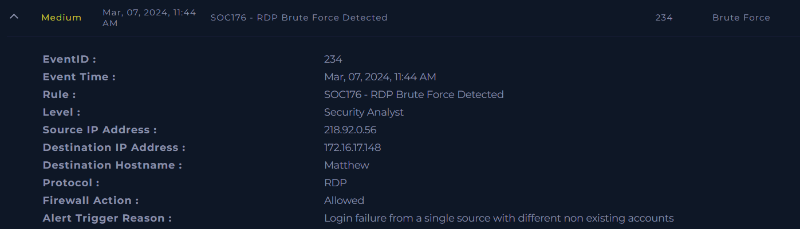
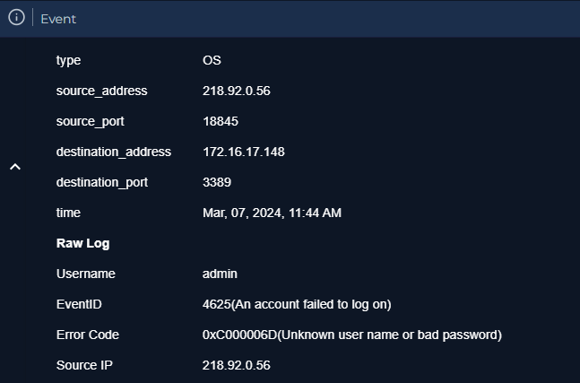
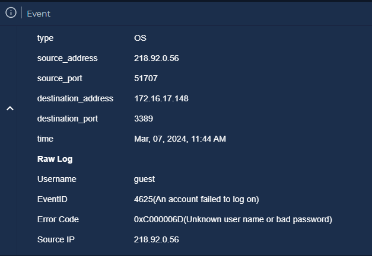
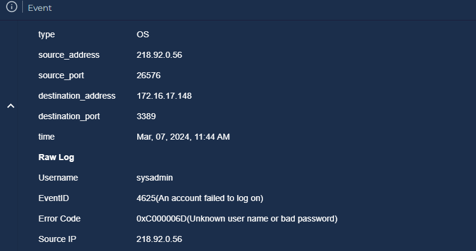
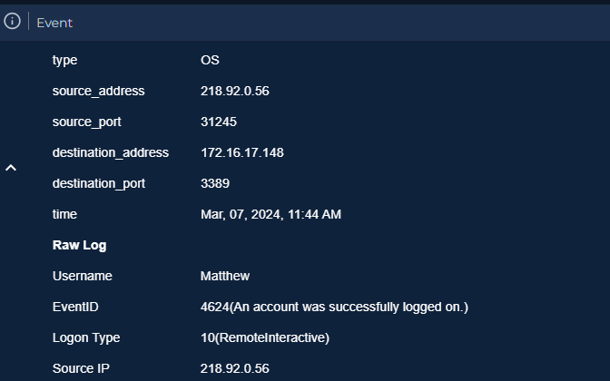
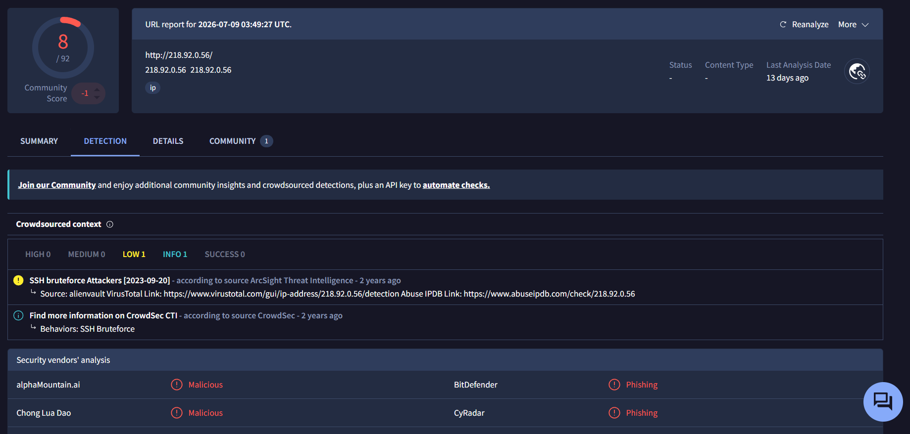
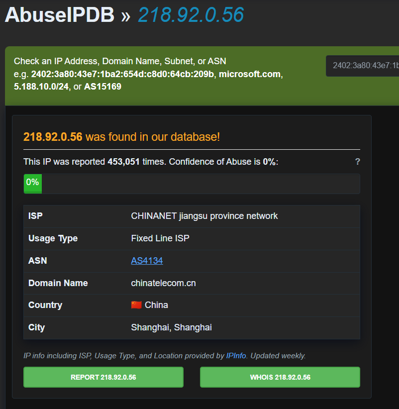

# SOC176 — RDP Brute Force Detected

**Platform:** LetsDefend
**Alert ID:** SOC176
**Severity:** Medium
**Category:** Brute Force

---

## 1. Alert Summary

An external IP address conducted a brute-force attack against RDP (port 3389) on host **Matthew (172.16.17.148)**, attempting multiple non-existent usernames before successfully authenticating using the username **"matthew"** — the same name as the hostname itself. The successful logon was confirmed as a genuine RDP session (Logon Type 10), and the source IP was independently confirmed malicious across multiple threat intelligence platforms.

| Field | Value |
|---|---|
| Source IP (Attacker) | 218.92.0.56 |
| Destination IP / Hostname | 172.16.17.148 / Matthew |
| Destination Port | 3389 (RDP) |
| Alert Time | Mar 07, 2024, 11:44 AM |
| Alert Trigger Reason | Login failure from a single source with different non-existing accounts |
| Firewall Action | Allowed |

*SIEM alert detail — SOC176, "RDP Brute Force Detected."*

---

## 2. Investigation Steps

### 2.1 Failed Authentication Attempts
Log Management was searched for authentication events between the source IP and the destination host. Multiple failed logon attempts (EventID 4625) were observed, using several non-existent or generic usernames:

*EventID 4625 — Username: admin, Error Code: 0xC000006D (Unknown username or bad password), Source IP: 218.92.0.56.*

*EventID 4625 — Username: guest, same source IP, same error code.*

*EventID 4625 — Username: sysadmin, same source IP, same error code.*

**Finding:** The attacker cycled through multiple generic/default usernames (admin, guest, sysadmin) — none of which are valid accounts on this host — consistent with an automated brute-force tool using a common credential wordlist rather than a targeted attack with prior knowledge of valid accounts.

### 2.2 Successful Authentication

*EventID 4624 — successful logon, Username: matthew, Logon Type 10 (RemoteInteractive), Source IP: 218.92.0.56 — same attacker IP as the failed attempts.*

**Critical finding — username/hostname match:** The attacker ultimately succeeded using the username **"matthew"** — identical to the machine's hostname. This indicates the attacker likely guessed the account name directly from the hostname, which was discoverable prior to authentication (e.g., via reverse DNS, network enumeration, or the RDP negotiation process itself). This represents a distinct, callable-out security weakness: **using a username that mirrors the hostname makes credential guessing significantly easier**, independent of password strength.

**Logon Type 10 (RemoteInteractive)** specifically confirms this was a genuine interactive RDP session, not a network logon or service logon — the attacker gained hands-on remote access to the desktop.

### 2.3 Threat Intelligence Enrichment

*VirusTotal — 218.92.0.56 flagged malicious by 8/92 vendors. Crowdsourced context includes an "SSH bruteforce Attackers" tag (source: AlienVault, via VirusTotal Community) and multiple vendors labeling the IP Malicious/Phishing.*

*AbuseIPDB — 218.92.0.56 reported 410,051 times. ISP: CHINANET jiangsu province network. Country: China (Shanghai).*

**Finding:** The extraordinarily high report count (410,051) confirms this is a well-known, persistent, high-volume malicious source — not an isolated or first-time offender. The SSH-bruteforce tag alongside the RDP activity observed here suggests this IP is used for broad, protocol-agnostic credential-stuffing campaigns rather than a single targeted technique.

---

## 3. MITRE ATT&CK Mapping

| Tactic | Technique |
|---|---|
| Credential Access | T1110 – Brute Force |
| Credential Access | T1110.001 – Password Guessing |
| Initial Access | T1133 – External Remote Services (RDP) |
| Initial Access | T1078 – Valid Accounts *(following successful authentication)* |

---

## 4. Verdict

> **True Positive — Confirmed successful RDP brute-force compromise.**

**Reasoning:**
- Multiple failed logon attempts using generic/default usernames, from a single external source IP, immediately followed by a successful logon from the same IP.
- The successful logon used a username matching the hostname — a distinct, identifiable weakness rather than a fluke.
- Logon Type 10 confirms genuine interactive remote access was achieved, not merely an authentication event.
- Source IP independently confirmed malicious across VirusTotal (8/92, SSH bruteforce attribution) and AbuseIPDB (410,051 reports).

---

## 5. Indicators of Compromise (IOC)

1. Source IP `218.92.0.56` — confirmed malicious on VirusTotal and AbuseIPDB.
2. Multiple failed RDP logon attempts using usernames admin, guest, sysadmin (EventID 4625).
3. Successful RDP logon using username "matthew," matching the hostname (EventID 4624, Logon Type 10).

---

## 6. Containment & Recommendations

- [ ] Isolate host Matthew (172.16.17.148) from the network.
- [ ] Disable or reset the "matthew" account and force a credential change.
- [ ] Investigate the host for any post-compromise activity performed during the attacker's RDP session (new processes, file changes, persistence mechanisms, outbound connections).
- [ ] Block source IP `218.92.0.56` at the network firewall.
- [ ] Disable direct internet exposure of RDP — restrict access to VPN/bastion host only.
- [ ] Enforce a strong password policy and enable account lockout after a small number of failed attempts.
- [ ] **Avoid usernames that mirror hostnames** — this specific weakness directly enabled the successful compromise here and should be addressed as a standing account-naming policy, not just for this host.
- [ ] Check for lateral movement — review whether the attacker's session made any connections to other internal hosts.

---

## 7. Closure

**Analyst Submission:** Malicious Activity Detected
**Alert Playbook Followed:** Yes
**Escalated:** Recommended — given confirmed successful remote access, escalate for post-compromise investigation of the host.

**Closure Note:**
> External IP 218.92.0.56 conducted a brute-force attack against RDP on host Matthew (172.16.17.148), cycling through generic usernames (admin, guest, sysadmin) before successfully authenticating as "matthew" — a username matching the hostname itself. Logon Type 10 confirms genuine interactive access was achieved. Source IP confirmed malicious on VirusTotal and AbuseIPDB (410,051 reports). Verdict: True Positive — confirmed successful compromise. Recommend host isolation, credential reset, IP block, and post-compromise investigation.

---

## Key Takeaways (Lessons for Future Investigations)

- Always check whether the successful login's username has any relationship to identifiable host information (hostname, domain, etc.) — a match is a specific, nameable weakness, not just "weak credentials."
- Logon Type is a small field with a large amount of meaning — Type 10 (RemoteInteractive) is what turns "an authentication event happened" into "the attacker had hands-on access to the desktop."
- A very high historical report count on AbuseIPDB (in the hundreds of thousands) is worth calling out explicitly — it distinguishes "a malicious IP" from "a persistent, industrial-scale scanning/attack source."
- The specific usernames attempted during failed logons can reveal whether an attack is generic/automated (common defaults) or targeted (organization-specific guesses) — always note the pattern, not just the count.
