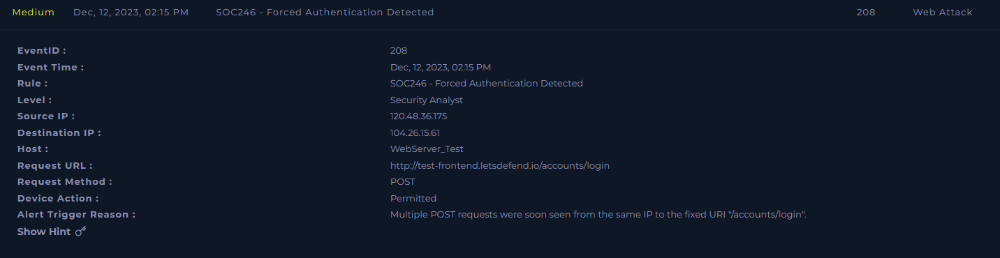
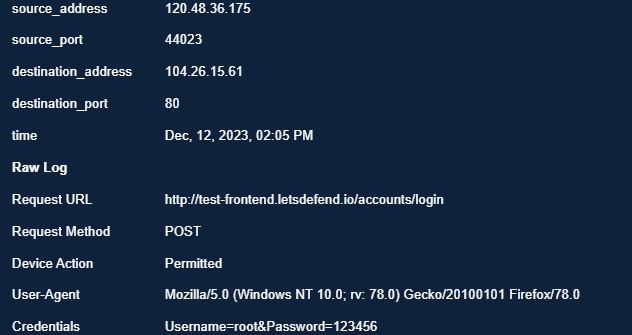
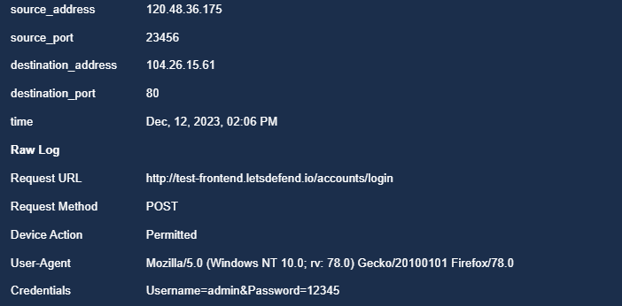
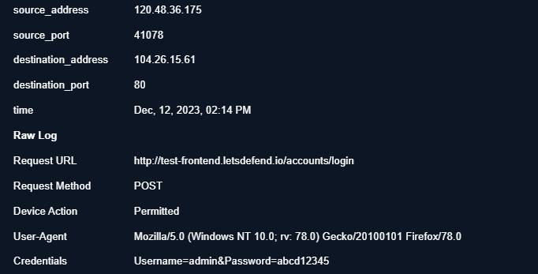
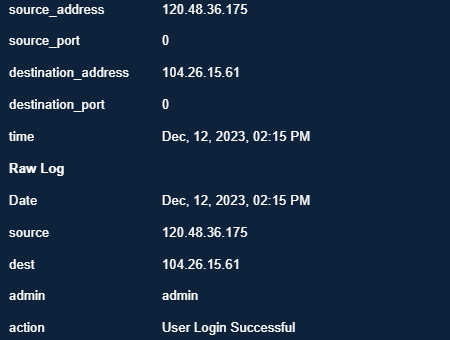
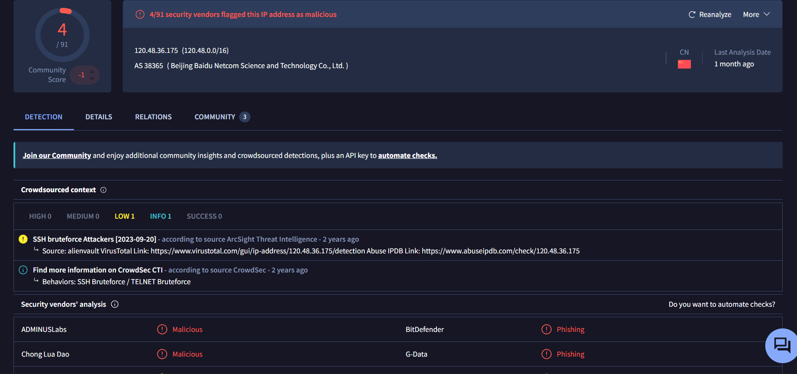
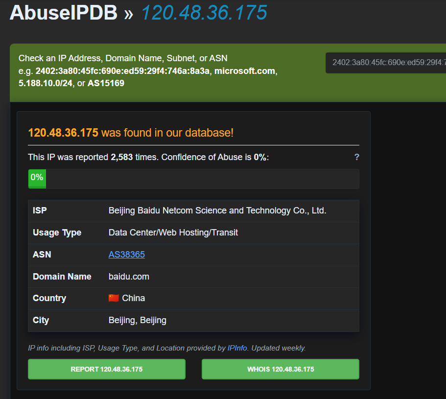

# SOC246 — Forced Authentication Detected (Web Application Brute Force)

**Platform:** LetsDefend
**Alert ID:** SOC246
**Severity:** Medium
**Category:** Web Attack

---

## 1. Alert Summary

An external IP address conducted a brute-force credential-guessing attack against the login endpoint of a test web server, using an automated tool with a generic credential wordlist. After 12 failed attempts across multiple username/password combinations, the attacker achieved a **successful login**. The login endpoint operates over unencrypted HTTP, meaning all submitted credentials — including the attacker's guesses and any legitimate user traffic — are transmitted in plaintext.

| Field | Value |
|---|---|
| EventID | 208 |
| Alert Time | Dec 12, 2023, 02:15 PM |
| Source IP (Attacker) | 120.48.36.175 |
| Destination IP / Host | 104.26.15.61 / WebServer_Test |
| Request URL | `http://test-frontend.letsdefend.io/accounts/login` |
| Request Method | POST |
| Destination Port | 80 (HTTP — unencrypted) |
| Device Action | Permitted |
| Alert Trigger Reason | Multiple POST requests seen from the same IP to the fixed URI "/accounts/login" |

*SIEM alert detail — SOC246, EventID 208, "Forced Authentication Detected."*

---

## 2. Investigation Timeline

| Time | Event |
|---|---|
| 02:05 PM | First observed failed login attempt: `Username=root&Password=123456` |
| 02:06 PM | Failed login attempt: `Username=admin&Password=12345` |
| ... | Additional failed attempts continue (12 total observed between 02:05–02:15 PM; 3 representative examples documented) |
| 02:14 PM | Failed login attempt: `Username=admin&Password=abcd12345` |
| 02:15 PM | **Successful login** — `admin` account, "User Login Successful" |

**Attack duration:** ~10 minutes, 12 failed attempts before success.

---

## 3. Investigation Steps

### 3.1 Log Analysis — Failed Login Attempts
Log Management was searched for all POST requests from source IP `120.48.36.175` to `/accounts/login`. A total of **12 failed login attempts** were observed between 02:05 PM and 02:15 PM, using multiple username/password combinations. Three representative examples are documented below.

*02:05 PM — Username=root, Password=123456. Permitted (reached the application; authentication failed).*

*02:06 PM — Username=admin, Password=12345.*

*02:14 PM — Username=admin, Password=abcd12345. Final failed attempt before the successful login one minute later.*

**Finding — attacker tooling:** The username `root` is not a typical web-application account name; it is the default superuser account on Linux/Unix systems, commonly targeted in SSH/Telnet brute-force tooling. Its use here, combined with the generic password list (`123456`, `12345`, `abcd12345`), indicates this is very likely an **automated scanning tool using a generic credential wordlist**, rather than a targeted attacker who researched this specific application. This is consistent with the threat intelligence findings in Section 3.3, which show this IP has a prior history of SSH/Telnet brute-force activity — this web server was very likely opportunistically discovered, not deliberately targeted.

### 3.2 Log Analysis — Successful Login

*02:15 PM — admin account, action: "User Login Successful."*

**Evidence gap:** This log entry does not include a password field (unlike the failed-attempt logs), so the specific password that succeeded **cannot be confirmed** from the evidence gathered. It is not possible to state with certainty whether the successful password matches one of the three examples shown, an unshown attempt from the full set of 12, or was otherwise obtained. This should be treated as an open item — if the credential can be recovered from a fuller log export, it should be checked against the organization's password policy, as a guessable/weak admin password would be a separate, significant root-cause finding.

### 3.3 Threat Intelligence — Source IP

*VirusTotal — 120.48.36.175 (AS38365, Beijing Baidu Netcom Science and Technology Co., Ltd., China) flagged 4/91 as malicious. Crowdsourced context: "SSH bruteforce Attackers" (ArcSight Threat Intelligence); CrowdSec CTI behaviors: SSH Bruteforce / TELNET Bruteforce.*

*AbuseIPDB — 120.48.36.175 reported 2,583 times. ISP: Beijing Baidu Netcom Science and Technology Co., Ltd. Usage type: Data Center/Web Hosting/Transit.*

The extremely high report count (2,583) combined with documented SSH/Telnet brute-force history confirms this is a known, persistent malicious scanning source — not a one-off incident.

### 3.4 Transport Security Finding
The login endpoint is served over **HTTP on port 80**, not HTTPS. This is independently significant: credentials submitted to this login form — by the attacker or by any legitimate user — are transmitted **unencrypted** and would be visible to anyone able to observe network traffic along the path. This is a root-cause infrastructure finding, separate from the brute-force activity itself, and should be remediated regardless of this specific incident's outcome.

### 3.5 Environment Context
The destination hostname (`WebServer_Test`) and subdomain (`test-frontend.letsdefend.io`) indicate this is a **test/staging environment**. A non-production system being directly internet-reachable, running weak/default-adjacent credentials, and lacking TLS represents a broader exposure issue independent of this specific attacker.

---

## 4. MITRE ATT&CK Mapping

| Tactic | Technique |
|---|---|
| Credential Access | T1110 – Brute Force |
| Credential Access | T1110.001 – Password Guessing |
| Initial Access | T1078 – Valid Accounts *(following successful authentication)* |

---

## 5. Indicators of Compromise (IOC)

1. Multiple (12) failed POST login attempts from a single external IP within a 10-minute window.
2. Use of varied, generic username/password combinations, including the non-application-typical username `root`.
3. Source IP `120.48.36.175` confirmed malicious via VirusTotal (4/91, SSH bruteforce attribution) and AbuseIPDB (2,583 reports).
4. Successful authentication to the `admin` account immediately following the failed attempts, from the same source IP.

---

## 6. Verdict

> **True Positive — Confirmed successful brute-force compromise of the admin account.**

**Reasoning:**
- Clear brute-force pattern: 12 failed authentication attempts across multiple credential combinations from a single IP, followed by a successful login to a privileged (`admin`) account.
- Source IP independently confirmed malicious by two threat intelligence platforms, with documented history of brute-force activity against other protocols (SSH/Telnet).
- The login endpoint transmits credentials over unencrypted HTTP, and is hosted on an internet-exposed test server — both of which materially increased the likelihood of this attack succeeding.

---

## 7. Containment & Recommendations

- [ ] Reset the credentials of the compromised `admin` account immediately.
- [ ] Invalidate all active sessions for the `admin` account and force re-authentication.
- [ ] Block source IP `120.48.36.175` at the firewall/WAF.
- [ ] Investigate post-compromise activity: review whether any data was accessed, modified, or exfiltrated using the `admin` session, and whether this IP had any prior successful connections to this or other internal systems.
- [ ] **Enforce HTTPS/TLS on the login endpoint** — this is a baseline requirement, not optional hardening; credentials are currently transmitted in plaintext.
- [ ] Implement an account lockout policy (e.g., lock after 4–5 failed attempts).
- [ ] Configure the WAF or load balancer to rate-limit login attempts from a single source IP.
- [ ] Enable MFA on the `admin` account and other privileged accounts — lockout policy alone does not prevent credential-stuffing attempts spread across multiple accounts.
- [ ] Review why a test/staging server is directly internet-exposed, and confirm it holds no production or sensitive data.

---

## 8. Closure

**Analyst Submission:** Malicious Activity Detected
**Alert Playbook Followed:** Yes
**Escalated:** Yes — recommend escalation to IR team for post-compromise investigation (data access/exfiltration review) given the successful login.

**Closure Note:**
> External IP 120.48.36.175 conducted a brute-force attack against the /accounts/login endpoint of WebServer_Test (104.26.15.61), attempting 12 failed logins with generic credentials before successfully authenticating to the admin account. Source IP confirmed malicious on VirusTotal and AbuseIPDB with documented SSH/Telnet brute-force history. Login endpoint uses unencrypted HTTP. Verdict: True Positive — confirmed account compromise. Recommend credential reset, session invalidation, IP block, TLS enforcement, lockout policy, and post-compromise investigation.

---

## Key Takeaways (Lessons for Future Investigations)

- State exactly what your screenshots represent versus the full evidence set — e.g., "12 attempts observed, 3 representative examples shown" — rather than implying every attempt pictured is the complete count.
- Don't assume the successful login used one of the credential combinations you happened to capture — check explicitly, and flag it as unconfirmed if the log doesn't show it.
- An unusual username (like `root` on a web app) is itself a clue about attacker tooling and intent — it can indicate generic/automated scanning rather than a targeted attack, which is useful context for prioritization.
- Cross-check the destination port in every log — plaintext HTTP on a login endpoint is a finding in its own right, independent of whatever attack triggered the alert.
- Note environment context (test vs. production hostnames) — it changes the risk conversation around why the exposure exists in the first place.
