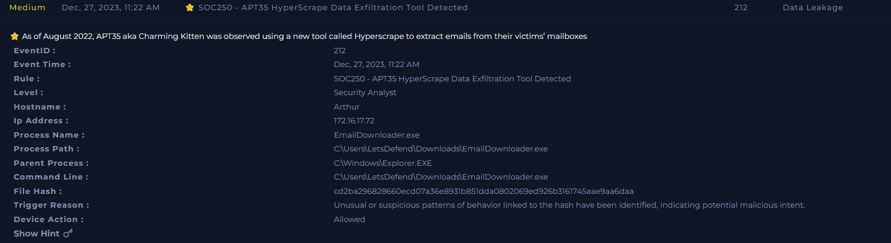
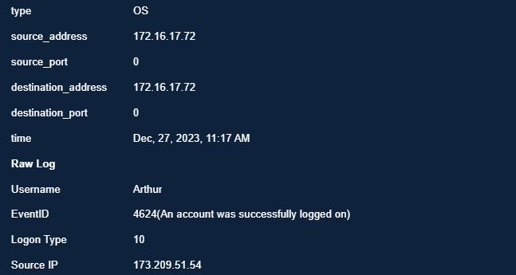
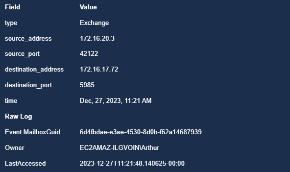
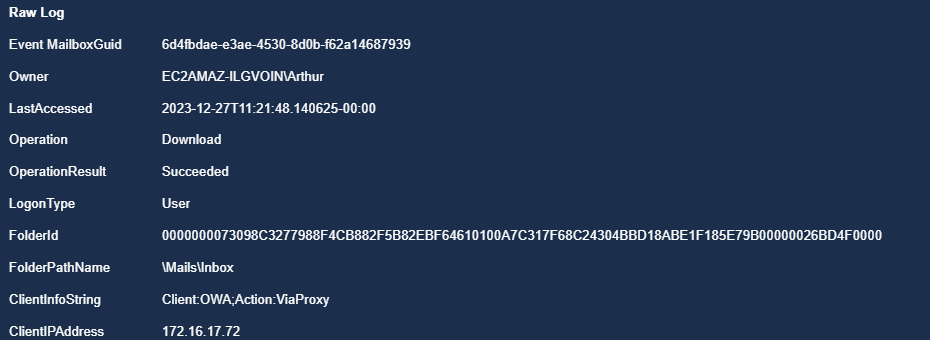
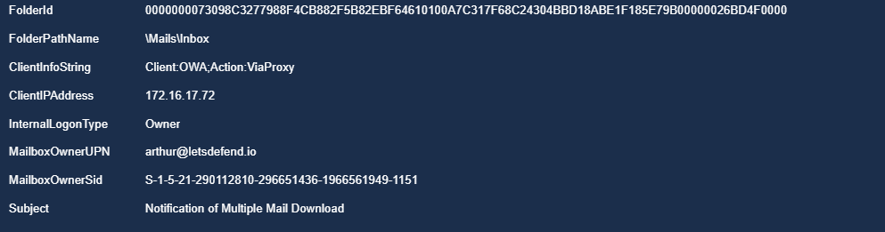
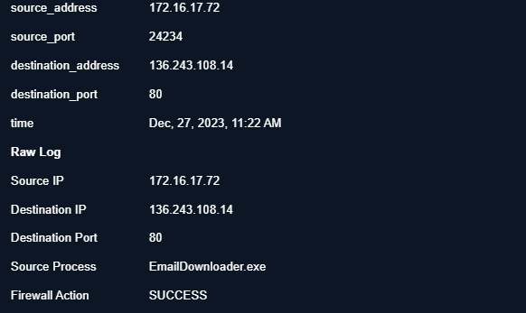
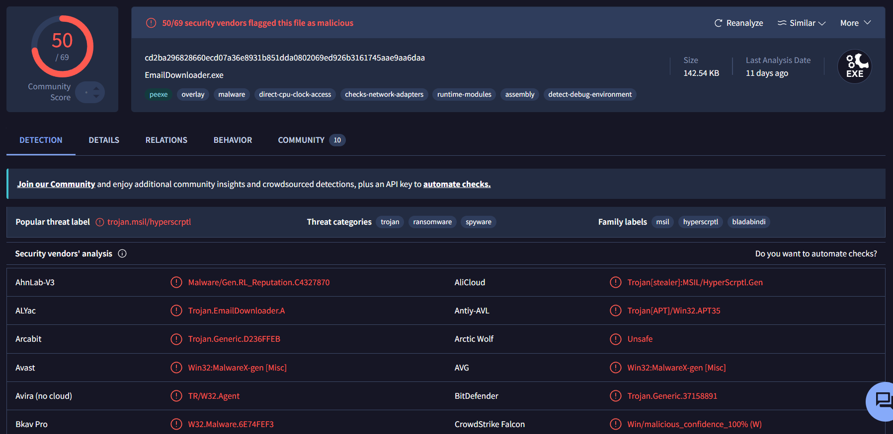
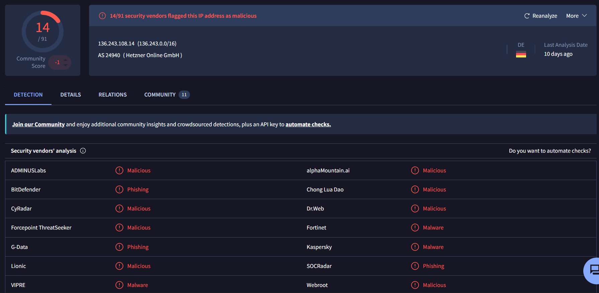
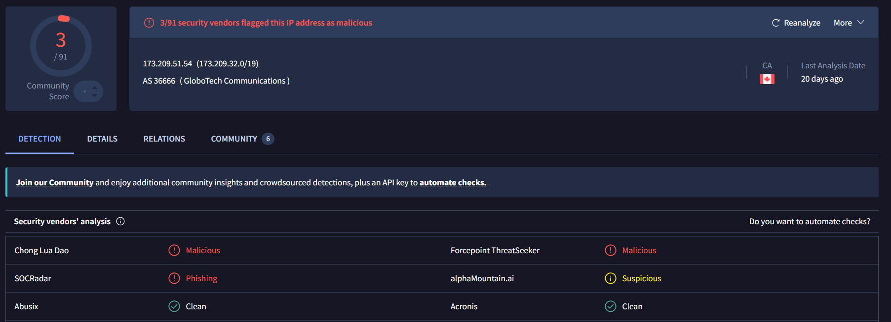

# SOC250 — APT35 HyperScrape Data Exfiltration Tool Detected

**Platform:** LetsDefend
**Alert ID:** SOC250
**Severity (initial):** Medium → **Escalated to Critical**
**Category:** Data Leakage

---

## 1. Alert Summary

A confirmed instance of **HyperScrape**, a custom mailbox-exfiltration tool attributed to **APT35 (Charming Kitten / Phosphorus)**, an Iranian state-sponsored threat group, was executed on host **Arthur (172.16.17.72)**. The attacker gained remote access via RDP using valid credentials — no failed authentication attempts precede the successful logon — then downloaded and executed `EmailDownloader.exe`, which accessed Arthur's mailbox via OWA and successfully exfiltrated inbox contents to an external, confirmed-malicious IP address.

| Field | Value |
|---|---|
| EventID | 212 |
| Alert Time | Dec 27, 2023, 11:22 AM |
| Affected Host / User | Arthur — 172.16.17.72 |
| RDP Source IP | 173.209.51.54 |
| Process Name | EmailDownloader.exe |
| Process Path | C:\Users\LetsDefend\Downloads\EmailDownloader.exe |
| Parent Process | C:\Windows\Explorer.EXE |
| File Hash (SHA256) | cd2ba296828660ecd07a36e8931b851dda0802069ed926b3161745aae9aa6daa |
| C2 / Exfil Destination IP | 136.243.108.14 |
| Device Action | Allowed |

*SIEM alert detail — SOC250, EventID 212, "APT35 HyperScrape Data Exfiltration Tool Detected." Per the alert's own threat context, HyperScrape was first observed in August 2022, used by APT35 to extract victim mailbox contents.*

---

## 2. Threat Actor Context

**APT35 (Charming Kitten / Phosphorus)** is an Iranian state-sponsored cyber-espionage group. Primary targets include academics, journalists, human rights activists, and government organizations across the US, Israel, and the Middle East. Their core tactics center on spear-phishing for credential harvesting, social engineering, and deployment of custom tooling. **HyperScrape** is purpose-built to authenticate to a victim's mailbox (often using previously stolen credentials or session cookies) and systematically download emails, attachments, and contacts while mimicking legitimate browser/OWA activity to minimize detection.

---

## 3. Investigation Timeline

| Time | Event |
|---|---|
| 11:17 AM | Successful RDP logon (EventID 4624, Logon Type 10) to Arthur's host from 173.209.51.54 — **no preceding failed logon attempts observed** |
| 11:21 AM | Mailbox accessed via OWA; `Operation: Download` recorded against `\Mails\Inbox`, `OperationResult: Succeeded` |
| 11:22 AM | Outbound connection from EmailDownloader.exe to 136.243.108.14:80 — firewall logs **SUCCESS**; SIEM alert SOC250 triggers |

**Total elapsed time, initial access to confirmed exfiltration: ~5 minutes.** This speed is consistent with HyperScrape's design as an automated, scripted collection tool rather than manual attacker interaction, and left a very narrow window for detection before data left the environment.

---

## 4. Investigation Steps

### 4.1 Initial Access — RDP Logon

*11:17 AM — EventID 4624 (successful logon), Logon Type 10 (RemoteInteractive/RDP), Username: Arthur, Source IP: 173.209.51.54.*

**Finding — no brute-force precursor:** Unlike a typical brute-force compromise, no failed logon attempts (EventID 4625) were found preceding this successful RDP session. This indicates the attacker very likely already possessed **valid credentials** for the Arthur account, rather than guessing them against this host. Given APT35's documented primary tactic of spear-phishing for credential harvesting, this strongly suggests the credential theft occurred in a **separate, prior compromise** (e.g., a phishing campaign not captured in this alert's scope) — meaning this incident may be the second stage of a larger intrusion, not an isolated event.

### 4.2 Malware Execution
Per the alert detail, `EmailDownloader.exe` was placed in `C:\Users\LetsDefend\Downloads\` and executed with `Explorer.EXE` as its parent process — consistent with a user (or an attacker operating interactively via the RDP session) manually running a downloaded file, rather than a fileless or scripted injection technique.

### 4.3 Mailbox Exfiltration — Exchange Audit Logs
Three Exchange log entries together establish that mailbox content was actually downloaded, not merely accessed:

*Mailbox GUID, Owner (EC2AMAZ-ILGVOIN\Arthur), LastAccessed: 2023-12-27T11:21:48.*

*Operation: Download, OperationResult: Succeeded, LogonType: User, FolderPathName: \Mails\Inbox.*

*ClientInfoString: Client:OWA;Action:ViaProxy, ClientIPAddress: 172.16.17.72, MailboxOwnerUPN: arthur@letsdefend.io, Subject: "Notification of Multiple Mail Download."*

**Confirmed finding:** The attacker accessed Arthur's mailbox via an **OWA (Outlook Web App) session, proxied**, and the `Operation: Download` / `OperationResult: Succeeded` fields confirm inbox content was **actually exfiltrated**, not merely queried. The email subject "Notification of Multiple Mail Download" is an automated system-generated alert, triggered by the mail platform in response to the tool's bulk-download behavior — not an artifact created by the attacker.

**Cloud environment note:** The mailbox owner field (`EC2AMAZ-ILGVOIN\Arthur`) indicates the compromised host is an **AWS EC2 Windows instance** (EC2AMAZ is AWS's default auto-generated hostname prefix). LetsDefend's Log Management does not provide access to AWS CloudTrail or Security Group configuration data, so it could not be determined within this platform whether RDP (port 3389) was directly exposed to the internet on this instance. **This has been flagged for the IR team to confirm with appropriate cloud console access**, as it would materially affect the initial-access theory in Section 4.1.

### 4.4 Outbound Connection / C2

*172.16.17.72 → 136.243.108.14:80/TCP, Source Process: EmailDownloader.exe, Firewall Action: SUCCESS.*

The exfiltrated mailbox data was transmitted outbound from the EmailDownloader.exe process to this external IP, coinciding with the alert trigger time.

### 4.5 Threat Intelligence Enrichment

**File hash:**

*VirusTotal — EmailDownloader.exe flagged malicious by 50/69 vendors. Popular threat label: trojan.msil/hyperscrptl. Threat categories: trojan, ransomware, spyware. Family labels include "hyperscrptl" and "bladabindi," and multiple vendors explicitly tag it Trojan[APT]/Win32.APT35.*

**C2 / exfil destination IP:**

*VirusTotal — 136.243.108.14 (AS24940, Hetzner Online GmbH, Germany) flagged malicious by 14/91 vendors.* Hetzner is a legitimate, low-cost VPS provider frequently abused for disposable attacker infrastructure due to minimal vetting at signup.

**RDP source IP:**

*VirusTotal — 173.209.51.54 (AS36666, GloboTech Communications, Canada) flagged malicious by 3/91 vendors, including a phishing tag from SOCRadar.* The phishing classification on the initial-access IP is consistent with the credential-theft-via-phishing theory in Section 4.1.

**All three IOCs in this case — initial-access IP, malware hash, and exfiltration IP — are independently confirmed malicious across threat intelligence platforms.**

---

## 5. MITRE ATT&CK Mapping

| Tactic | Technique |
|---|---|
| Initial Access | T1078 – Valid Accounts *(no brute-force evidence; credentials very likely pre-compromised elsewhere)* |
| Initial Access | T1133 – External Remote Services (RDP) |
| Collection | T1114.002 – Email Collection: Remote Email Collection |
| Exfiltration | T1567 – Exfiltration Over Web Service *(OWA)* |
| Exfiltration | T1041 – Exfiltration Over C2 Channel |

---

## 6. Verdict

> **True Positive — Confirmed APT35 mailbox exfiltration via HyperScrape.**

**Reasoning:**
- Successful RDP logon with no preceding failed attempts, indicating use of pre-compromised valid credentials.
- Executed file confirmed malicious by 50/69 VirusTotal vendors, explicitly attributed to APT35/HyperScrape.
- Exchange audit logs confirm a **succeeded** download operation against the inbox via an OWA proxy session — not merely an access attempt.
- Outbound connection to a confirmed-malicious external IP coincides exactly with the download event, consistent with successful exfiltration.
- Initial-access IP independently flagged for phishing activity, consistent with APT35's documented TTPs.

**Severity reassessment:** Alert was generated as **Medium**, but given confirmed nation-state attribution, confirmed malware execution, and confirmed successful data exfiltration, this should be treated as **Critical** for response purposes.

---

## 7. Indicators of Compromise (IOC)

1. RDP logon session from external IP `173.209.51.54` with no preceding failed attempts (suggests pre-compromised credentials).
2. Outbound connection to confirmed-malicious IP `136.243.108.14`.
3. Malicious file hash `cd2ba296828660ecd07a36e8931b851dda0802069ed926b3161745aae9aa6daa` (EmailDownloader.exe), flagged by 50/69 vendors, attributed to APT35/HyperScrape.
4. Confirmed outbound mailbox data transfer coinciding with the download event.

---

## 8. Containment & Recommendations

- [ ] Isolate Arthur's host (172.16.17.72) from the network immediately.
- [ ] Disconnect all active sessions for the Arthur account and force a password change.
- [ ] Block IPs `173.209.51.54` (RDP source) and `136.243.108.14` (exfil destination) at the perimeter firewall.
- [ ] Block file hash `cd2ba296828660ecd07a36e8931b851dda0802069ed926b3161745aae9aa6daa` (EmailDownloader.exe) across EDR/AV.
- [ ] Enable MFA on Arthur's account and review whether it was enabled at time of compromise — its absence is a likely contributing factor to how a stolen credential led to full RDP and mailbox access.
- [ ] Escalate to the IR team for full forensic investigation of the suspected APT compromise, including:
  - Verification (via AWS CloudTrail / Security Group config, outside this platform's visibility) of whether RDP was directly internet-exposed on this EC2 instance.
  - Investigation for lateral movement and persistence mechanisms, given RDP access was achieved.
  - Full review of Arthur's account and host activity following the compromise.
  - Investigation into where the underlying credential theft occurred, since no brute-force evidence exists on this host.
- [ ] Check whether any other users/hosts were contacted by the RDP source IP or received connections from the C2 IP.
- [ ] Apply heightened outbound data-transfer monitoring/DLP controls for mailbox and file-download activity.

---

## 9. Closure

**Analyst Submission:** Malicious Activity Detected — Confirmed APT Compromise
**Alert Playbook Followed:** Yes
**Escalated:** Yes — escalated to IR team for full forensic investigation, cloud configuration verification, and lateral movement/persistence check.

**Closure Note:**
> Host Arthur (172.16.17.72) was accessed via RDP from 173.209.51.54 using valid credentials (no failed logons observed), followed by execution of EmailDownloader.exe — confirmed via VirusTotal (50/69) as APT35's HyperScrape tool. Exchange logs confirm a succeeded mailbox download via OWA, with outbound transfer to confirmed-malicious IP 136.243.108.14 (Hetzner). All three IOCs (RDP source IP, file hash, C2 IP) independently confirmed malicious. Verdict: True Positive — confirmed nation-state (APT35) mailbox exfiltration. Severity escalated to Critical. Recommend host isolation, credential reset, MFA enforcement, IOC blocklisting, and full IR escalation including cloud configuration review (outside this platform's log visibility) and lateral movement/persistence investigation.

---

## Key Takeaways (Lessons for Future Investigations)

- The **absence** of failed login attempts before a successful logon is itself a finding — it points toward pre-compromised credentials rather than brute force, and should reframe the investigation toward "where did credential theft happen" rather than just "is this host compromised."
- Enrich every IP in the chain, not just the most obviously malicious one — the initial-access IP here carried its own independent confirmation (phishing tag) that reinforced the credential-theft theory.
- When a tool or platform can't answer a question within its own scope (e.g., cloud configuration data not available in LetsDefend), say so explicitly and route it to whoever has the right access, rather than skipping the question or guessing. That's a stronger signal of judgment than pretending to verify something you couldn't.
- Exchange/mailbox audit log fields like `Operation` and `OperationResult` are what separate "attacker had access" from "attacker actually took data" — read them precisely rather than summarizing loosely.
- A very short dwell time between access and exfiltration (minutes, not hours) usually indicates automated/scripted tooling — note it, since it affects how much detection window realistically existed.
