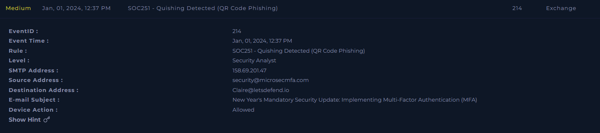
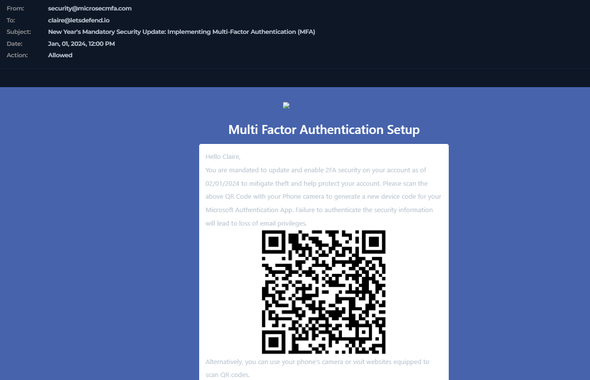
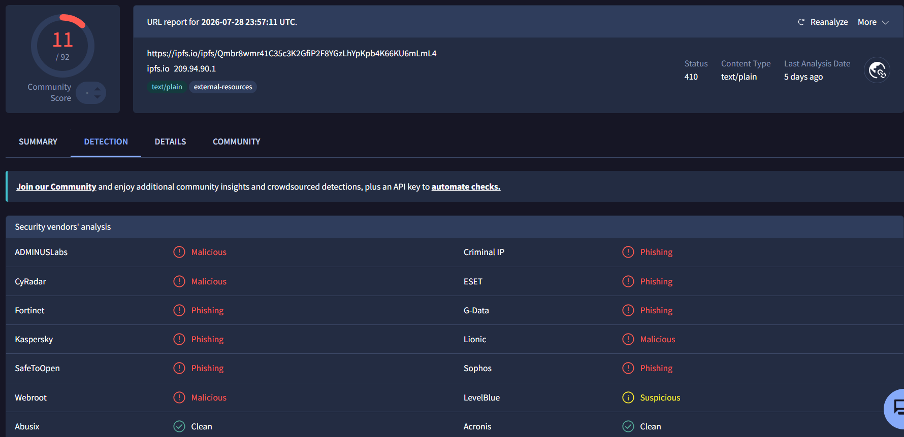
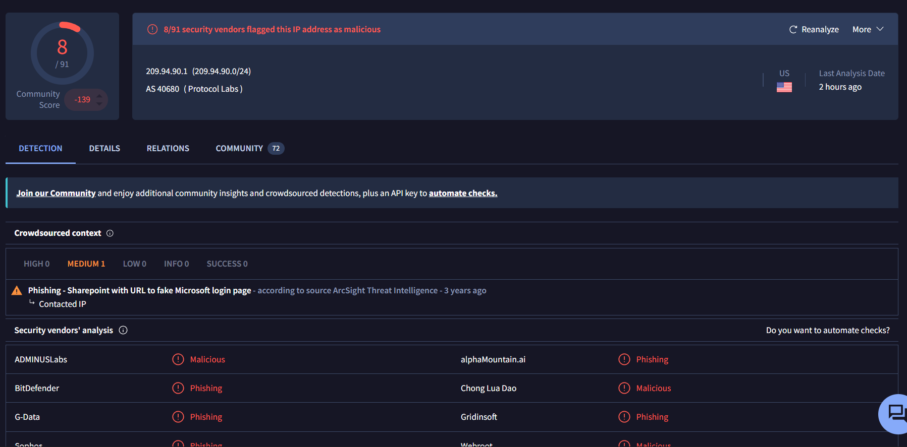
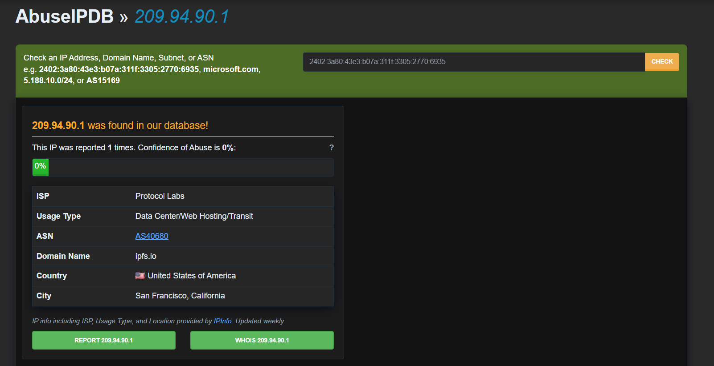
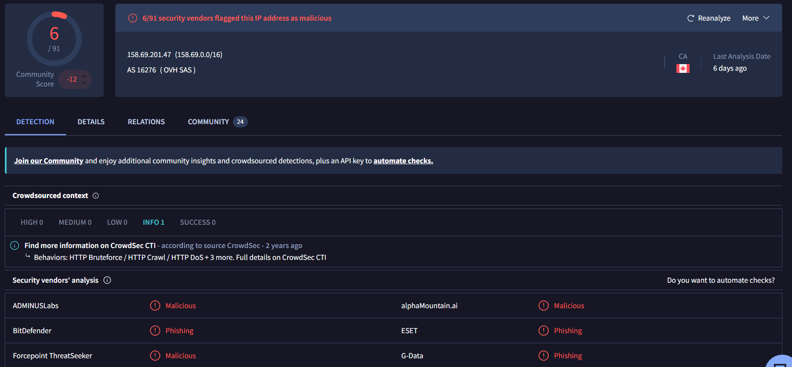

# SOC251 — Quishing Detected (QR Code Phishing)

**Platform:** LetsDefend
**Alert ID:** SOC251
**Severity:** Medium
**Category:** Exchange

---

## 1. Alert Summary

User **Claire (Claire@letsdefend.io)** received an email impersonating a Microsoft MFA security notice, warning of a mandatory MFA setup deadline. Instead of a clickable link, the email embedded a **QR code** — a technique known as **quishing** — which, when decoded, resolves to a malicious URL hosted on the public IPFS network. The destination serves a fake Microsoft login page designed to harvest credentials.

| Field | Value |
|---|---|
| EventID | 214 |
| Alert Time | Jan 01, 2024, 12:37 PM |
| Affected User | Claire@letsdefend.io |
| Sender | security@microsecmfa.com |
| SMTP Source IP | 158.69.201.47 |
| Subject | "New Year's Mandatory Security Update: Implementing Multi-Factor Authentication (MFA)" |
| Device Action | Allowed |
| Decoded QR URL | `https://ipfs.io/ipfs/Qmbr8wmr41C35c3K2GfiP2F8YGzLhYpKpb4K66KU6mLmL4` |
| Hosting IP (ipfs.io gateway) | 209.94.90.1 |


*SIEM alert detail — SOC251, EventID 214, "Quishing Detected (QR Code Phishing)."*

---

## 2. Investigation Timeline

| Time | Event |
|---|---|
| 12:00 PM | Phishing email delivered via SMTP from 158.69.201.47 to Claire@letsdefend.io |
| 12:37 PM | SIEM alert SOC251 triggered — "Quishing Detected (QR Code Phishing)" |

---

## 3. Investigation Steps

### 3.1 Email Review
The email impersonated a mandatory Microsoft MFA enrollment notice, using urgency and a compliance threat ("Failure to authenticate... will lead to loss of email privileges") to pressure the user into scanning the embedded QR code with a phone camera, rather than clicking a traditional link.


*"New Year's Mandatory Security Update" phishing email — QR code embedded in place of a clickable link.*

**Sender domain analysis:** `microsecmfa.com` is a lookalike/brand-impersonation domain, clearly engineered to resemble "Microsoft Security MFA" and lend false legitimacy to the request.

### 3.2 QR Code Decoding
The QR code was manually decoded to reveal the underlying destination, since it cannot be inspected as a normal hyperlink:
```
https://ipfs.io/ipfs/Qmbr8wmr41C35c3K2GfiP2F8YGzLhYpKpb4K66KU6mLmL4
```
This is a public **IPFS (InterPlanetary File System)** gateway URL. The path segment following `/ipfs/` (`Qmbr8wmr41C35c3K2GfiP2F8YGzLhYpKpb4K66KU6mLmL4`) is a **content identifier (CID)** — a hash uniquely identifying the hosted content, regardless of which public gateway serves it.

### 3.3 Threat Intelligence — Destination URL

*VirusTotal — the decoded IPFS URL flagged by 11/92 vendors as malicious/phishing.*

### 3.4 Threat Intelligence — Hosting Infrastructure
The resolved hosting IP for the ipfs.io gateway was checked separately:


*VirusTotal — 209.94.90.1 (AS40680, Protocol Labs, US) flagged 8/91 as malicious/phishing. Crowdsourced context: "Phishing - Sharepoint with URL to fake Microsoft login page" (ArcSight Threat Intelligence).*


*AbuseIPDB — 209.94.90.1 reported only once, 0% abuse confidence. ISP: Protocol Labs, associated with domain ipfs.io.*

**Important nuance:** `209.94.90.1` belongs to **Protocol Labs**, the organization operating the public **ipfs.io gateway** — legitimate, widely-used infrastructure. The IP itself is not inherently malicious; it is **shared public infrastructure being abused to serve attacker-controlled content**. The low AbuseIPDB report count and 0% confidence reflect this: the abuse signal sits with the specific content (the CID) and the crowdsourced phishing tag, not with the IP as a whole. This is a meaningful distinction for containment — see Section 6.

### 3.5 Threat Intelligence — SMTP Source

*VirusTotal — 158.69.201.47 (AS16276, OVH SAS, Canada) flagged 6/91 as malicious/phishing. CrowdSec context: behaviors include HTTP Bruteforce, HTTP Crawl, HTTP DoS, and others.*

The sending infrastructure has an established history of abusive behavior beyond this single phishing campaign, per CrowdSec CTI.

### 3.6 Visibility Limitation — Why This Attack Technique Matters
Quishing is specifically designed to be scanned with a **phone camera**, meaning any interaction with the malicious link — the redirect, the fake login page, and any credential entry — would occur on Claire's **mobile/personal device**, entirely outside the corporate network and outside SOC-monitored proxy/EDR telemetry. Standard endpoint or web proxy logs on Claire's corporate laptop will show **no evidence of a click**, even if the attack fully succeeded. This is precisely why attackers use QR codes: it evades email link-rewriting, sandboxing, and endpoint-based URL monitoring. **The user must be contacted directly** to determine whether she scanned the code and, if so, what information (if any) she entered on the resulting page.

---

## 4. MITRE ATT&CK Mapping

| Tactic | Technique |
|---|---|
| Initial Access | T1566.002 – Phishing: Spearphishing Link (delivered via QR code as a detection-evasion mechanism) |

---

## 5. Indicators of Compromise (IOC)

1. Highly targeted social-engineering pretext — a "mandatory yearly security update" designed to create urgency and compliance pressure.
2. Sender domain `microsecmfa.com` — a lookalike domain impersonating Microsoft/MFA branding to appear legitimate.
3. QR code embedded in place of a standard hyperlink, resolving to a malicious URL hosted on a public IPFS gateway.
4. IPFS content identifier (CID) `Qmbr8wmr41C35c3K2GfiP2F8YGzLhYpKpb4K66KU6mLmL4` — durable artifact identifying the exact malicious content regardless of which gateway serves it.
5. SMTP source IP `158.69.201.47` — flagged malicious by 6 vendors, with CrowdSec-reported history of HTTP Bruteforce/Crawl/DoS behavior.

---

## 6. Verdict

> **True Positive — Confirmed quishing (QR code phishing) attempt.**

**Reasoning:**
- Sender domain is a clear Microsoft/MFA brand impersonation.
- QR-embedded URL decodes to a public IPFS gateway link flagged malicious by multiple vendors, with crowdsourced threat intel explicitly describing it as a fake Microsoft login page.
- SMTP source IP has an independent history of abusive behavior.
- Delivery via QR code (rather than a standard link) is itself a known evasion technique, reinforcing malicious intent rather than incidental appearance.

**Scope note:** Because the attack vector requires scanning with a separate device, this investigation cannot confirm from network/email logs alone whether the user interacted with the malicious page. That determination requires direct user contact.

---

## 7. Containment & Recommendations

- [ ] Isolate Claire's host from the network as a precaution while user contact and further investigation are pending.
- [ ] **Contact Claire directly** to determine whether she scanned the QR code with her phone and, if so, whether she entered any credentials on the resulting page — this cannot be determined from corporate network logs alone.
- [ ] Delete the phishing email from Claire's mailbox, and search all mailboxes for the same sender/subject to identify other recipients.
- [ ] Block sender `security@microsecmfa.com` and domain `microsecmfa.com` at the email gateway.
- [ ] Block SMTP source IP `158.69.201.47` at the perimeter firewall.
- [ ] **Note on IPFS-hosted content:** blocking `209.94.90.1` or `ipfs.io` outright has limited effectiveness — the same content (identified by its CID) remains accessible via numerous other public IPFS gateways (e.g., `cloudflare-ipfs.com`, `dweb.link`). Prioritize blocking/flagging the specific **content hash** at the email and proxy layer where supported, and treat inbound emails containing IPFS gateway links (`ipfs.io/ipfs/...`) as high-scrutiny by default, since legitimate business email rarely references IPFS content.
- [ ] Reset Claire's credentials as a precaution if scanning/interaction is confirmed or cannot be ruled out.
- [ ] Conduct organization-wide awareness communication on quishing — specifically that QR codes in email should be treated with the same suspicion as embedded links, and that scanning shifts the risk to whatever device is used to scan.

---

## 8. Closure

**Analyst Submission:** Malicious Activity Detected (Quishing)
**Alert Playbook Followed:** Yes
**Escalated:** Recommended, pending direct confirmation from the user regarding QR interaction.

**Closure Note:**
> Claire received a phishing email impersonating a mandatory Microsoft MFA update from a lookalike domain (microsecmfa.com). The email contained a QR code (quishing) resolving to a malicious URL on a public IPFS gateway, flagged malicious by multiple vendors and identified via crowdsourced intel as a fake Microsoft login page. SMTP source IP also flagged malicious with a history of abusive behavior. Verdict: True Positive. Because the attack requires a phone scan, interaction cannot be confirmed from corporate network logs — user contact required. Recommend blocklisting sender/domain/SMTP IP, targeted blocking of the specific IPFS content hash, and organization-wide quishing awareness.

---

## Key Takeaways (Lessons for Future Investigations)

- QR-code phishing shifts the point of interaction to an unmonitored device — always state this visibility gap explicitly rather than assuming standard logs would show a click.
- Don't equate "hosted by a flagged IP" with "the IP itself is malicious infrastructure" — shared/public services (IPFS gateways, cloud storage, CDNs) are frequently abused, and the more durable, actionable indicator is often the specific content identifier or path, not the shared IP.
- IP/domain blocking has limited value against content-addressed hosting like IPFS, since the same content can be served from many different gateways — call this out and recommend content-hash-based controls where possible.
- Always name brand-impersonation domains explicitly as a distinct indicator, rather than folding it into a general "phishing email" description.
