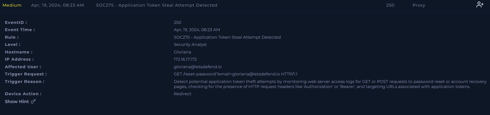
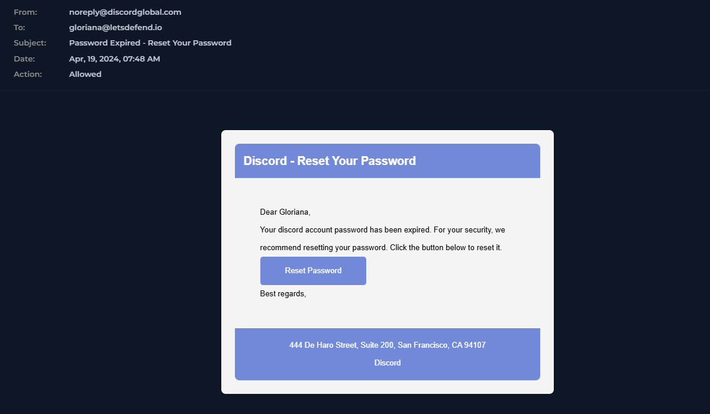
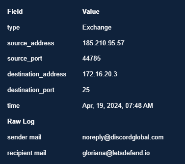
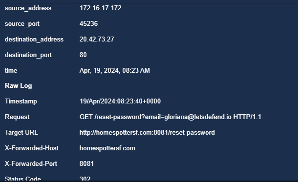
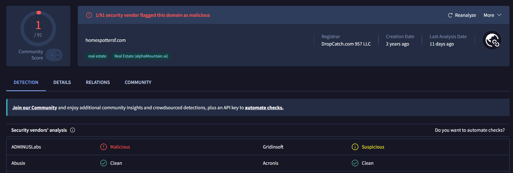
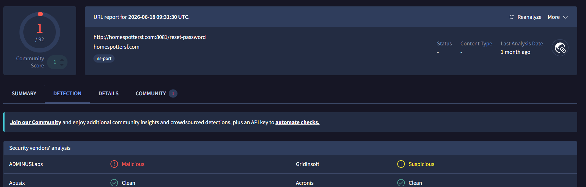

# SOC275 — Application Token Steal Attempt Detected (Phishing / Credential Harvesting)

**Platform:** LetsDefend
**Alert ID:** SOC275
**Severity:** Medium
**Category:** Proxy
**Analyst:** Avdhut Gogawale
**Date Investigated:** [analysis date]

---

## 1. Alert Summary

User **Gloriana (gloriana@letsdefend.io)** received a phishing email impersonating Discord, claiming her password had expired. The embedded "Reset Password" link redirected her browser to a lookalike password-reset page hosted on a repurposed real estate domain (`homespottersf.com`), running on a non-standard port. VirusTotal confirms the domain and URL as malicious. The request passed her real organizational email address as a parameter to the phishing page — suggesting the target was her actual corporate credentials, not just a Discord login.

| Field | Value |
|---|---|
| EventID | 250 |
| Alert Time | Apr 19, 2024, 08:23 AM |
| Affected User / Host | Gloriana — 172.16.17.172 |
| Sender | noreply@discordglobal.com |
| SMTP Source IP | 185.210.95.57 |
| Subject | "Password Expired - Reset Your Password" |
| Trigger Request | `GET /reset-password?email=gloriana@letsdefend.io HTTP/1.1` |
| Device Action | Redirect |
| Phishing Domain | homespottersf.com:8081 |
| Hosting IP | 20.42.73.27 |
| Response Status | 302 (redirect) |

*SIEM alert detail — SOC275, EventID 250, "Application Token Steal Attempt Detected."*

---

## 2. Investigation Timeline

| Time | Event |
|---|---|
| 07:48 AM | Phishing email delivered via SMTP from 185.210.95.57 to gloriana@letsdefend.io |
| 08:23 AM | Gloriana clicks the "Reset Password" link; proxy log shows GET request, redirected (302) to homespottersf.com:8081 |
| 08:23 AM | SIEM alert SOC275 triggered — "Application Token Steal Attempt Detected" |

**Dwell time (email → click):** ~35 minutes.

---

## 3. Investigation Steps

### 3.1 Email / Exchange Log Review
The email impersonated Discord, using an urgency-based lure ("Your password has expired") and a "Reset Password" call-to-action button — a standard credential-phishing template.

*"Password Expired - Reset Your Password" phishing email impersonating Discord.*

Exchange raw log confirms sender infrastructure:

*Raw Exchange log — sender 185.210.95.57 (noreply@discordglobal.com) → gloriana@letsdefend.io, port 25.*

- **Sender domain:** `discordglobal.com` — not Discord's legitimate domain (discord.com); a lookalike brand-impersonation domain.
- Email was **Allowed** through the mail gateway.

### 3.2 Proxy Log — Confirming the Click and Redirect
The proxy log confirms Gloriana's browser actually followed the link:

*Proxy log — 172.16.17.172 (Gloriana) requested `/reset-password?email=gloriana@letsdefend.io`, X-Forwarded-Host: homespottersf.com, port 8081, Status Code: 302.*

**Key finding:** The request passes `email=gloriana@letsdefend.io` — her **actual corporate email address** — as a URL parameter to the phishing page, not a Discord account identifier. This indicates the page is very likely designed to harvest her **organizational credentials** under a Discord-branded pretext, not just a Discord password. This raises the severity of the finding beyond a simple third-party account phish.

The destination also runs on **port 8081**, a non-standard port for a password-reset page — itself a supporting indicator of malicious infrastructure, and the connection resolved to hosting IP `20.42.73.27:80`.

### 3.3 Threat Intelligence — Domain Reputation
The redirect domain was checked on VirusTotal:

*VirusTotal — `homespottersf.com` flagged 1/91 as malicious. Registrar: DropCatch.com 957 LLC. Creation date: 2 years ago. Categorized as "real estate."*

**Finding:** This domain was originally registered for a legitimate real-estate business, but is now serving a Discord-branded credential harvesting page. Combined with the registrar being **DropCatch** (a service specifically used to acquire expired/dropped domains), this matches a known attacker pattern: repurposing aged domains with pre-existing reputation and category history to evade fresh-domain detection and reduce block-list hits.

The full URL was also checked separately:

*VirusTotal — `http://homespottersf.com:8081/reset-password` flagged 1/92 as malicious, tagged `ns-port` (non-standard port).*

### 3.4 Scope Check
No evidence was gathered in this investigation confirming whether Gloriana submitted credentials on the landing page (no POST request with credential data appears in the logs reviewed), and no other recipients of this phishing email were checked at time of this report — **this should be the immediate next step**, not an assumption either way.

---

## 4. MITRE ATT&CK Mapping

| Tactic | Technique |
|---|---|
| Initial Access | T1566.002 – Phishing: Spearphishing Link |
| Credential Access | T1598.003 – Phishing for Information: Spearphishing Link (credential/token harvesting page) |

---

## 5. Verdict

> **True Positive — Confirmed phishing / attempted credential (application token) theft.**

**Reasoning:**
- Email impersonates Discord from a non-legitimate sending domain (`discordglobal.com`), confirmed via Exchange logs.
- Proxy logs confirm the user clicked the link and was redirected (HTTP 302) to an external, non-standard port on a domain flagged malicious by VirusTotal.
- The redirect request carried the user's **real corporate email address** as a parameter — indicating the likely target is organizational credentials, not merely a Discord account.
- Domain registration history (repurposed real-estate domain via DropCatch) is consistent with known credential-phishing infrastructure patterns.

**Important scope note:** This confirms an **attempted** credential/token theft — the click and redirect are proven. Whether Gloriana actually submitted credentials on the landing page (i.e., whether the theft *succeeded*) is **not confirmed** by the logs reviewed here, since no follow-up POST request was found. This should be explicitly investigated next, not assumed as a successful data breach.

---

## 6. Artifacts

| Value | Type | Comment |
|---|---|---|
| `noreply@discordglobal.com` | Email Address | Phishing sender, impersonating Discord |
| `discordglobal.com` | Domain | Phishing sender domain (brand impersonation) |
| `185.210.95.57` | IP Address | SMTP source of phishing email |
| `homespottersf.com` | Domain | Repurposed domain hosting credential-harvesting page |
| `http://homespottersf.com:8081/reset-password` | URL | Phishing landing page (non-standard port) |
| `20.42.73.27` | IP Address | Hosting IP resolved for the phishing domain |

---

## 7. Containment & Recommendations

- [ ] Isolate Gloriana's host `172.16.17.172` from the network pending further investigation.
- [ ] Reset Gloriana's LetsDefend/organizational account password immediately, given her real email address was passed to the phishing page.
- [ ] Add `homespottersf.com` (and hosting IP `20.42.73.27`) to the web proxy/firewall blocklist.
- [ ] Block sender `noreply@discordglobal.com` and domain `discordglobal.com` at the email gateway.
- [ ] Search Exchange logs for other recipients of the same phishing email (subject: "Password Expired - Reset Your Password" / sender domain `discordglobal.com`) and confirm whether any of them also clicked through.
- [ ] Review proxy logs for any subsequent POST request from Gloriana's host to the phishing domain to determine whether credentials were actually submitted.
- [ ] Recommend enabling MFA on Gloriana's account if not already enforced, to limit impact even if credentials were captured.

---

## 8. Closure

**Analyst Submission:** Malicious Activity Detected (Phishing — Attempted Credential/Token Theft)
**Alert Playbook Followed:** Yes
**Escalated:** Recommended — pending confirmation of whether credentials were submitted.

**Closure Note:**
> Gloriana (172.16.17.172) received a Discord-themed phishing email from noreply@discordglobal.com and clicked a "Reset Password" link, redirecting to homespottersf.com:8081 — flagged malicious on VirusTotal and hosted on a repurposed real-estate domain. The request passed Gloriana's real corporate email as a parameter, suggesting the page targets organizational credentials. Verdict: True Positive (attempted token/credential theft). No confirmation of successful credential submission found in logs reviewed. Recommend password reset, domain/IP blocklisting, and a check for other affected recipients.

---

## Key Takeaways (Lessons for Future Investigations)

- Distinguish clearly between an **attempted** credential theft (click + redirect confirmed) and a **successful** one (credentials actually submitted) — don't state the stronger claim unless the logs support it.
- Always inspect URL parameters in the request itself — an email address, token, or ID passed to a phishing page can reveal the actual target of the attack, not just the disguise being used.
- Check domain registration details (registrar, creation date, category) — a domain repurposed from a legitimate business via a drop-catch service is a distinct and useful indicator, not just "flagged malicious."
- Non-standard ports on what should be a simple web page are worth calling out explicitly as a supporting indicator.
- Always state explicitly whether you checked for other affected recipients — and if you didn't get to it, name it as the next step rather than leaving it implied.
