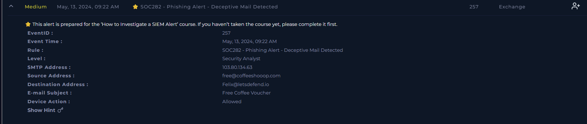
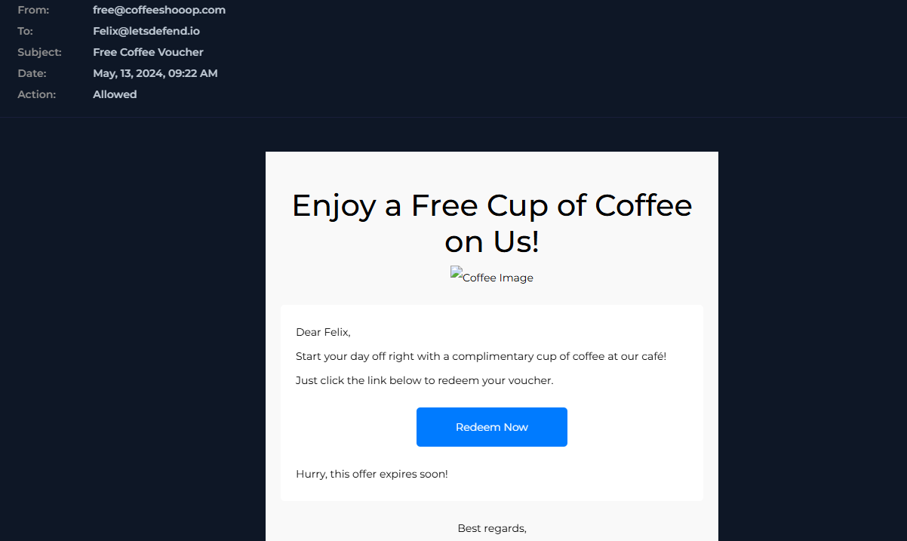
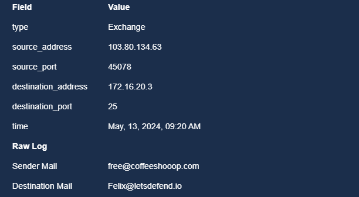
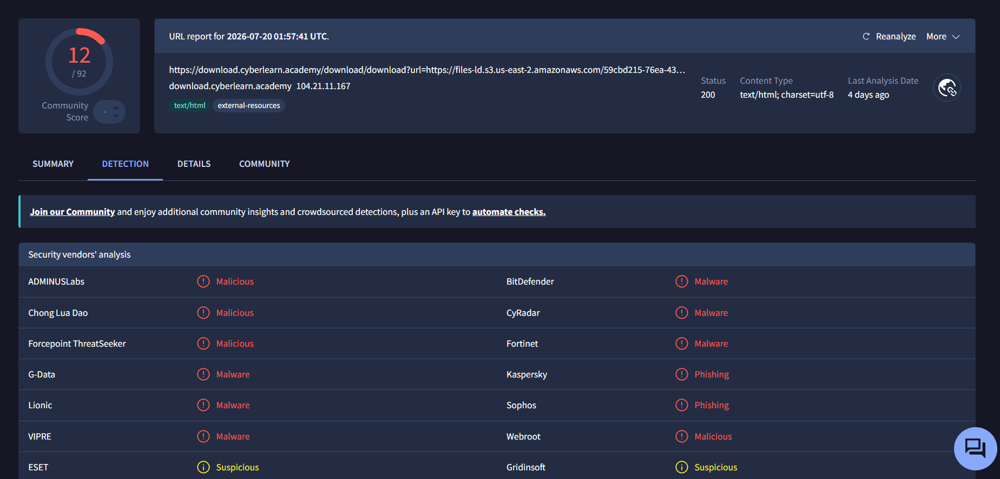
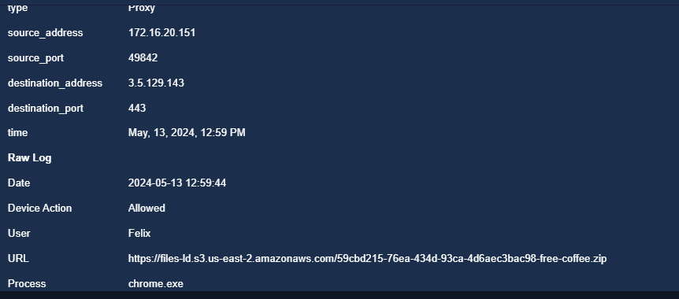
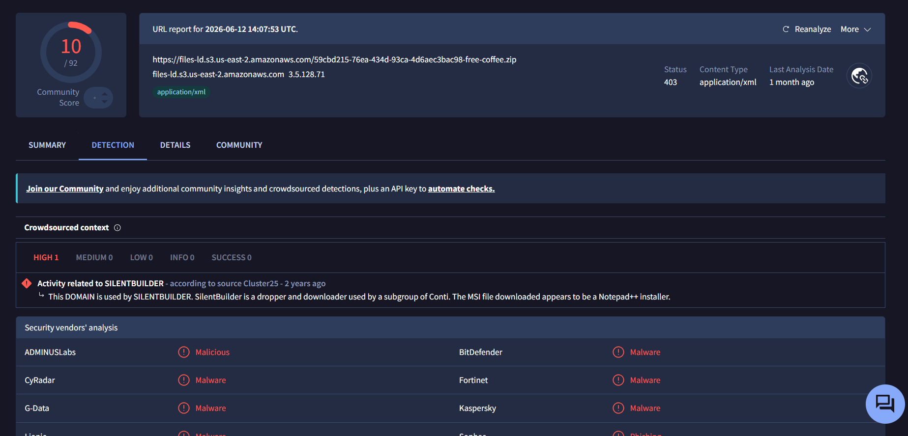
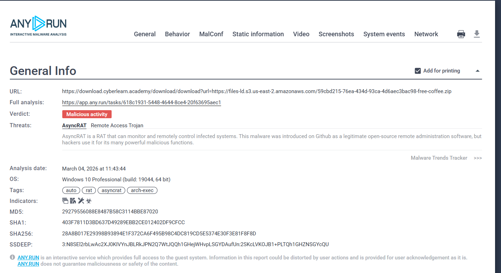
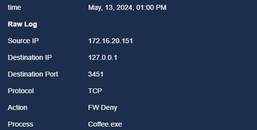
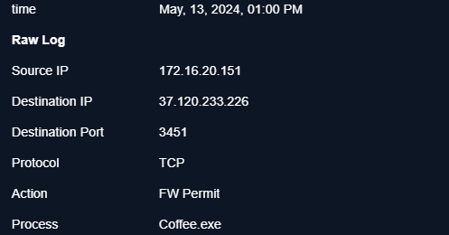

# SOC282 — Phishing Alert: Deceptive Mail Detected (AsyncRAT Delivery)

**Platform:** LetsDefend
**Alert ID:** SOC282
**Severity (initial):** Medium → **Escalated to Critical**
**Category:** Exchange / Phishing
**Analyst:** Avdhut Gogawale
**Date Investigated:** 13 May 2024 (alert) / [analysis date]

---

## 1. Alert Summary

A phishing email was delivered to user **Felix (Felix@letsdefend.io)** using a social-engineering lure ("Free Coffee Voucher"). The embedded link led through a redirect service to a payload hosted on AWS S3, which dropped and executed **Coffee.exe** — sandboxed and confirmed as **AsyncRAT**, a Remote Access Trojan. The infected host subsequently made an outbound connection to a confirmed C2 IP address, which the firewall **permitted**.

| Field | Value |
|---|---|
| EventID | 257 |
| Alert Time | May 13, 2024, 09:22 AM |
| Affected User / Host | Felix — 172.16.20.151 |
| Sender | free@coffeeshooop.com (typosquat domain) |
| SMTP Source IP | 103.80.134.63 |
| Subject | "Free Coffee Voucher" |
| Device Action (email) | Allowed |
| Malicious File | Coffee.exe |
| Identified Malware | **AsyncRAT** (Remote Access Trojan) |
| C2 IP | 37.120.233.226:3451/TCP |


*SIEM alert detail — SOC282, EventID 257, phishing email from free@coffeeshooop.com to Felix.*

---

## 2. Investigation Timeline

| Time | Event |
|---|---|
| 09:20 AM | Phishing email delivered via SMTP from 103.80.134.63 to Felix@letsdefend.io |
| 09:22 AM | SIEM alert SOC282 triggered — "Phishing Alert - Deceptive Mail Detected" |
| 12:59 PM | Felix clicks the "Redeem Now" link; proxy log shows request to `files-ld.s3.us-east-2.amazonaws.com/...free-coffee.zip` — **Allowed**, port 443 |
| 01:00 PM | Coffee.exe executes on host; firewall logs show **two** outbound attempts to C2 IP `37.120.233.226:3451` — one **Denied**, one **Permitted** |

**Dwell time (email → click):** ~3 hours 39 minutes
**Time from download to execution/C2 attempt:** ~1 minute — near-instant execution, no user hesitation observed.

---

## 3. Investigation Steps

### 3.1 Email / Exchange Log Review
The phishing email was reviewed directly. It impersonated a coffee shop promotion, using urgency language ("Hurry, this offer expires soon!") and a call-to-action button to drive the user to click.


*"Free Coffee Voucher" phishing email — social engineering lure with "Redeem Now" button.*

Exchange raw log confirms sender infrastructure:


*Raw Exchange log — sender 103.80.134.63, free@coffeeshooop.com → Felix@letsdefend.io, port 25.*

- **Sender domain:** `coffeeshooop.com` — a typosquat/lookalike domain (extra "o"), a classic phishing infrastructure pattern.
- Email was **Allowed** through the mail gateway — no pre-delivery block existed for this sender at alert time.

### 3.2 URL / Redirect Chain Analysis
The "Redeem Now" button pointed to a redirector rather than the payload directly:
```
https://download.cyberlearn.academy/download/download?url=https://files-ld.s3.us-east-2.amazonaws.com/59cbd215-76ea-434d-93ca-4d6aec3bac98-free-coffee.zip
```


*VirusTotal — redirect URL flagged 12/92 vendors as malicious/malware/phishing.*

### 3.3 Proxy Log — Confirming User Interaction
The proxy log confirms Felix's host actually reached out and downloaded the payload:


*Proxy log — 172.16.20.151 (Felix, chrome.exe) requested the S3-hosted zip at 12:59:44 PM, port 443, Action: Allowed.*

This is the key piece of evidence proving the user clicked the link and the download succeeded — not just that the email arrived.

### 3.4 Payload URL Threat Intelligence
The actual hosting URL for the payload was checked separately from the redirector:


*VirusTotal — payload hosting URL (files-ld.s3...amazonaws.com) flagged 10/92 vendors. Crowdsourced context: "Activity related to SILENTBUILDER" (source: Cluster25) — a dropper/downloader used by a Conti subgroup. The delivered file masquerades as a Notepad++ installer.*

**Two distinct threat-intel findings here, not one:**
1. The **redirect service** (`download.cyberlearn.academy`) is the delivery mechanism.
2. The **hosting domain** (`files-ld.s3...amazonaws.com`) is tied to **SILENTBUILDER** infrastructure, associated with a Conti ransomware subgroup.

### 3.5 Sandbox Analysis (ANY.RUN)
The downloaded file was detonated in a sandbox for behavioral confirmation:


*ANY.RUN — Verdict: Malicious activity. Threat identified: **AsyncRAT** (Remote Access Trojan). OS: Windows 10 Pro (build 19044, 64-bit).*

| Hash Type | Value |
|---|---|
| MD5 | `29279556088E8487B58C3114BBE87020` |
| SHA1 | `403F7811D3BD637D49289EBB2CE012402DF9CFCC` |
| SHA256 | `28A8B017E29398B93894E1F372CA6F495B98C4DC819CD5E5374E30F3E81F8F8D` |

### 3.6 Firewall Logs — Confirming C2 Communication
Two firewall log entries were found for outbound connections from Coffee.exe to the same C2 IP and port:


*172.16.20.151 → 127.0.0.1:3451/TCP — FW Deny — Process: Coffee.exe*


*172.16.20.151 → 37.120.233.226:3451/TCP — **FW Permit** — Process: Coffee.exe*

**Finding:** Coffee.exe made two outbound connection attempts on port 3451/TCP. One was denied (to a loopback/internal address) and one — to the actual external C2 IP `37.120.233.226` — was **permitted**. This confirms the C2 channel was successfully established, not just attempted.

### 3.7 Scope Check — Other Hosts
Log Management was searched for destination IP `37.120.233.226` across all hosts in the environment. **Only 172.16.20.151 (Felix)** returned results. No other internal host shows any connection attempt to this C2 address, and no other recipients of the phishing email were identified in Exchange logs.

> **Scope confirmed: single host affected. No lateral spread observed.**

---

## 4. MITRE ATT&CK Mapping

| Tactic | Technique |
|---|---|
| Initial Access | T1566.002 – Phishing: Spearphishing Link |
| Execution | T1204.002 – User Execution: Malicious File |
| Command & Control | T1105 – Ingress Tool Transfer |
| Command & Control | T1071 – Application Layer Protocol |

---

## 5. Verdict

> **True Positive — Confirmed malicious execution with successful C2 communication.**

**Reasoning:**
- Phishing email from a typosquat domain, confirmed malicious by VirusTotal (12/92) on the redirect URL and 10/92 on the payload URL.
- Proxy logs confirm the user actually downloaded the payload (not just received the email).
- Sandbox analysis (ANY.RUN) positively identifies the payload as **AsyncRAT**, a Remote Access Trojan.
- Firewall logs confirm an outbound connection to the identified C2 IP (`37.120.233.226:3451`) was **permitted**, meaning C2 communication was established, not merely attempted.
- Hosting infrastructure is linked to **SILENTBUILDER** (Cluster25), associated with a Conti ransomware subgroup — raising the risk profile beyond a generic RAT infection.

**Severity reassessment:** Alert was generated as **Medium**, but given confirmed RAT execution and successful C2 callback, this should be treated as **Critical** for response purposes.

---

## 6. Artifacts

| Value | Type | Comment |
|---|---|---|
| `free@coffeeshooop.com` | Email Address | Phishing sender (typosquat domain) |
| `coffeeshooop.com` | Domain | Phishing sender domain |
| `103.80.134.63` | IP Address | SMTP source of phishing email |
| `download.cyberlearn.academy` | Domain | Redirect/delivery service |
| `files-ld.s3.us-east-2.amazonaws.com` | Domain | Payload hosting, linked to SILENTBUILDER |
| `https://files-ld.s3.us-east-2.amazonaws.com/59cbd215-76ea-434d-93ca-4d6aec3bac98-free-coffee.zip` | URL | Malicious payload download URL |
| `37.120.233.226` | IP Address | Confirmed C2 — connection permitted by firewall |
| `Coffee.exe` | File Name / Process | Dropped executable, identified as AsyncRAT |
| `29279556088E8487B58C3114BBE87020` | Hash – MD5 | AsyncRAT sample |
| `403F7811D3BD637D49289EBB2CE012402DF9CFCC` | Hash – SHA1 | AsyncRAT sample |
| `28A8B017E29398B93894E1F372CA6F495B98C4DC819CD5E5374E30F3E81F8F8D` | Hash – SHA256 | AsyncRAT sample |

---

## 7. Containment & Recommendations

- [ ] Isolate host `172.16.20.151` (Felix) from the network immediately.
- [ ] Block C2 IP `37.120.233.226` at the perimeter firewall.
- [ ] Block sender address, sender domain, and hosting domain (`coffeeshooop.com`, `files-ld.s3...amazonaws.com`, `download.cyberlearn.academy`) at the email gateway and web proxy.
- [ ] Hunt the MD5/SHA1/SHA256 hashes across EDR/AV on all endpoints to rule out spread via other vectors (USB, file share).
- [ ] Search all mailboxes for the same phishing email (subject "Free Coffee Voucher" / sender `coffeeshooop.com`) to identify any other recipients.
- [ ] Escalate to IR team to determine whether AsyncRAT achieved persistence (registry run keys, scheduled tasks, services) and whether any secondary payload was downloaded via the established C2 channel.
- [ ] Reset credentials for the affected user as a precaution, given RAT capability includes keylogging.

---

## 8. Closure

**Analyst Submission:** Malicious Activity Detected
**Alert Playbook Followed:** Yes
**Escalated:** Yes — escalated to IR/Tier 2 for host isolation, hash-based hunting, and persistence check.

**Closure Note:**
> Phishing email from free@coffeeshooop.com delivered malicious link to Felix (172.16.20.151). User clicked, downloading Coffee.exe via files-ld.s3...amazonaws.com (linked to SILENTBUILDER/Conti). Sandbox (ANY.RUN) identified payload as AsyncRAT. Coffee.exe executed and connected to C2 IP 37.120.233.226:3451 — one attempt Permitted, confirming successful C2 access. No other hosts found contacting this IP. Verdict: True Positive. Recommend isolating host, blocking C2 IP and phishing domain, and hash-based hunting across environment.

---

## Key Takeaways (Lessons for Future Investigations)

- A single "Allowed" log entry among several "Denied" entries for the same destination is often the most important line in the whole case — don't skim past it.
- Always separate threat intel findings by **which part of the delivery chain** they describe (redirector vs. hosting vs. payload) rather than merging them into one sentence.
- Sandbox verdicts (ANY.RUN, etc.) that name a specific malware family should drive severity and response — "malicious file" and "AsyncRAT" are not the same level of urgency.
- Hashes aren't optional documentation — they're the actual hunting artifact for checking the rest of the environment.
- Always explicitly state the scope-check result ("only 1 host affected, confirmed via search") — absence of evidence is only useful if you show you looked.
