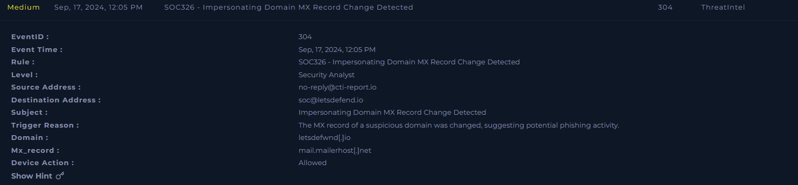
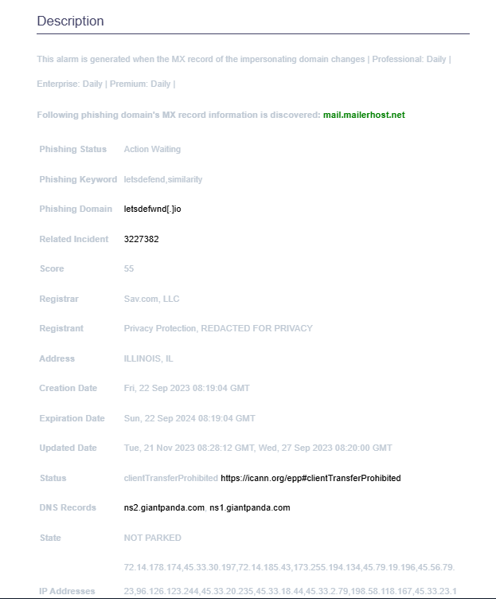
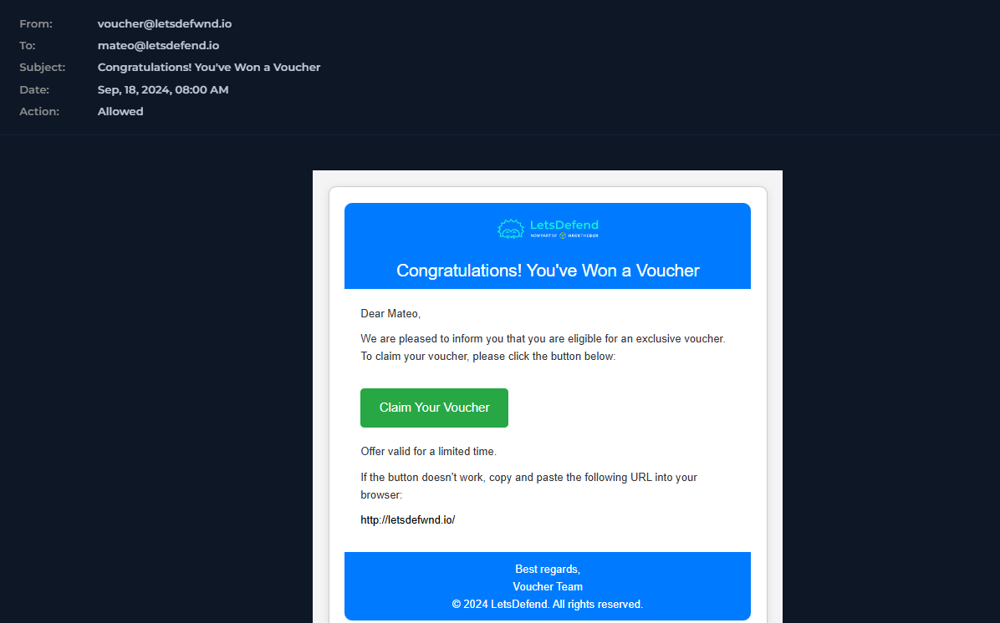
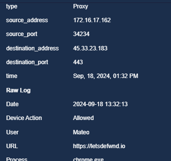
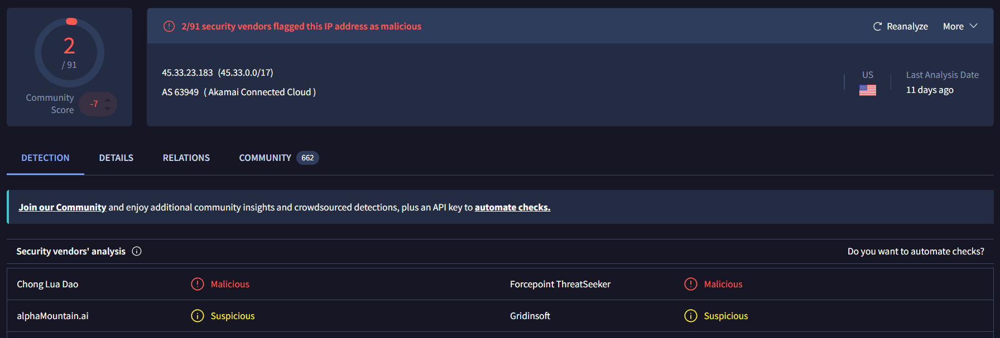
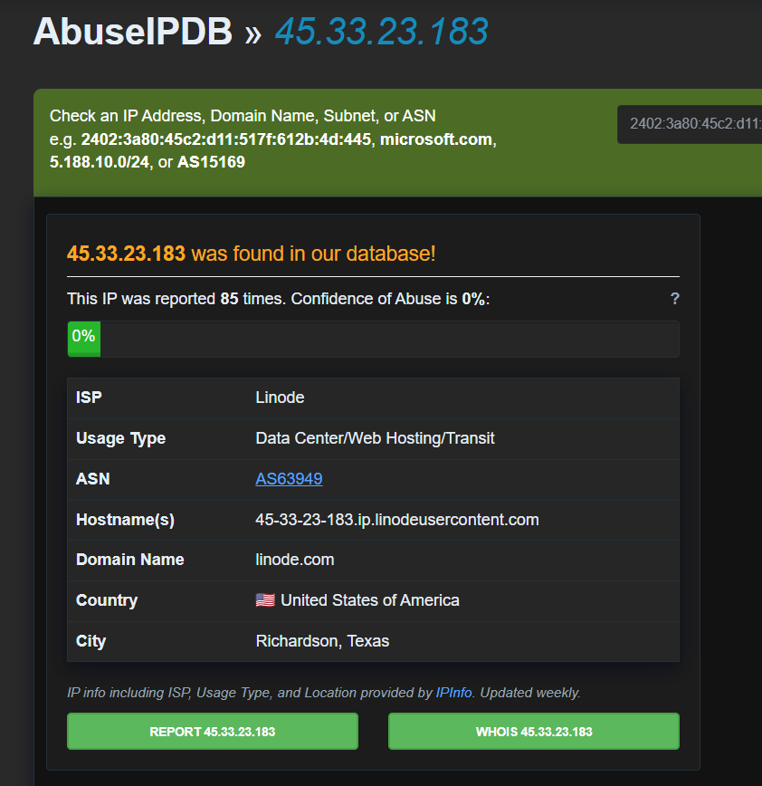

# SOC326 — Impersonating Domain MX Record Change Detected

**Platform:** LetsDefend
**Alert ID:** SOC326
**Severity:** Medium
**Category:** ThreatIntel

---

## 1. Alert Summary

A threat intelligence feed (`cti-report.io`) detected that a **typosquat domain impersonating the organization** — `letsdefwnd[.]io` (visually similar to `letsdefend.io`) — had its MX (mail exchange) record configured to `mail.mailerhost.net`. This indicates the domain's registrant was setting up email-sending infrastructure, consistent with preparation for a phishing campaign. Approximately 20 hours later, a phishing email using this exact domain was delivered to user **Mateo**, who clicked the embedded link and reached the attacker-controlled site.

**Important clarification:** This alert does **not** indicate LetsDefend's own domain (`letsdefend.io`) or its real DNS/MX records were altered or compromised. The affected domain is a separate, attacker-registered lookalike domain — the alert is a leading indicator that this impersonating domain was being weaponized, not evidence of a takeover of organizational infrastructure.

| Field | Value |
|---|---|
| EventID | 304 |
| Alert Time | Sep 17, 2024, 12:05 PM |
| CTI Source | no-reply@cti-report.io |
| Destination | soc@letsdefend.io |
| Impersonating Domain | letsdefwnd[.]io |
| New MX Record | mail.mailerhost[.]net |
| Device Action | Allowed |

*SIEM alert detail — SOC326, EventID 304, "Impersonating Domain MX Record Change Detected."*

---

## 2. Investigation Timeline

| Time | Event |
|---|---|
| Sep 22, 2023 | Typosquat domain `letsdefwnd[.]io` registered (per WHOIS/CTI data) — **~1 year before** it was weaponized |
| Sep 17, 2024, 12:05 PM | CTI alert (SOC326): MX record for the impersonating domain updated to `mail.mailerhost.net` |
| Sep 18, 2024, 08:00 AM | Phishing email sent from `voucher@letsdefwnd.io` to `mateo@letsdefend.io` (~19.9 hours after the CTI alert) |
| Sep 18, 2024, 01:32 PM | Mateo clicks the embedded link, reaching `http://letsdefwnd.io/` (~5.5 hour dwell time after email delivery) |

**Notable gap:** ~20 hours elapsed between the infrastructure-setup alert (SOC326) and the actual phishing email landing in Mateo's inbox. This is a missed proactive-blocking window — see Section 8.

---

## 3. Investigation Steps

### 3.1 CTI Alert Review

*CTI alert description — impersonating domain `letsdefwnd[.]io`, phishing keyword match ("letsdefend," similarity score 55), MX record `mail.mailerhost.net`. Registrar: Sav.com, LLC. Creation Date: Fri, 22 Sep 2023. Status: clientTransferProhibited.*

**Finding — domain aging:** The domain was registered approximately **one year before** it was activated for phishing. This is a known evasion technique: attackers register lookalike domains early and allow them to sit dormant to accumulate DNS/reputation age, since newly-registered domains are more likely to be automatically flagged by security tooling. This domain's dormancy period suggests deliberate, patient campaign preparation rather than opportunistic, last-minute registration.

### 3.2 Phishing Email Delivery
The following day, a phishing email using the impersonating domain was delivered to user Mateo:

*"Congratulations! You've Won a Voucher" — sent from voucher@letsdefwnd.io to mateo@letsdefend.io, using a reward/urgency lure and a "Claim Your Voucher" button linking to http://letsdefwnd.io/.*

This confirms the CTI alert's prediction: the impersonating domain, once its mail infrastructure (MX record) was in place, was used within a day to launch an active phishing campaign against an internal user.

### 3.3 Proxy Log — Confirming the Click

*Proxy log — 172.16.17.162 (Mateo), chrome.exe, requested https://letsdefwnd.io/ at 01:32:13 PM, port 443, Device Action: Allowed.*

**Confirmed:** Mateo clicked the phishing link and successfully reached the attacker-controlled domain. **Not confirmed:** whether any credentials or information were submitted on the resulting page — no POST request or credential-data log entry was found in the evidence reviewed. This distinction matters for scoping the response; see Section 6.

### 3.4 Threat Intelligence — Hosting Infrastructure

*VirusTotal — 45.33.23.183 (AS63949, Akamai Connected Cloud, US) flagged malicious/suspicious by 2/91 vendors.*

*AbuseIPDB — 45.33.23.183 reported 85 times. ISP: Linode, hostname 45-33-23-183.ip.linodeusercontent.com.*

**Note:** "Akamai Connected Cloud" (VirusTotal) and "Linode" (AbuseIPDB) refer to the same underlying infrastructure — Akamai acquired Linode and rebranded its cloud hosting division; this is not a data inconsistency.

**On the URL scan result:** `http://letsdefwnd.io/` returned **0 detections** on VirusTotal at time of review. This does not indicate the URL is safe — a 0-detection result commonly means a URL has not yet been indexed/crawled by scanning engines, particularly for a domain whose malicious infrastructure (MX record) had only just been activated. The domain-level CTI detection (phishing keyword match, similarity score 55, MX record change) is a stronger and more specific signal here than the general-purpose URL scanner's current silence, since it comes from monitoring purpose-built to catch brand-impersonation domains.

---

## 4. MITRE ATT&CK Mapping

| Tactic | Technique |
|---|---|
| Resource Development | T1583.001 – Acquire Infrastructure: Domains |
| Initial Access | T1566.002 – Phishing: Spearphishing Link |
| Execution | T1204.001 – User Execution: Malicious Link |

---

## 5. Indicators of Compromise (IOC)

1. Impersonating/typosquat domain `letsdefwnd[.]io`.
2. MX record `mail.mailerhost[.]net` configured on the impersonating domain.
3. Phishing sender `voucher@letsdefwnd.io`.
4. Phishing URL `http://letsdefwnd.io/`.
5. Hosting IP `45.33.23.183`, independently flagged across VirusTotal and AbuseIPDB.

---

## 6. Verdict

> **True Positive — Confirmed typosquat phishing domain, weaponized and clicked by an internal user.**

**Reasoning:**
- CTI feed confirmed a domain closely impersonating the organization (similarity score 55) configured mail infrastructure, consistent with phishing preparation.
- A phishing email using this exact domain was delivered and clicked by Mateo within approximately 24 hours of the infrastructure being set up.
- Hosting IP independently confirmed suspicious/malicious across two threat intelligence platforms.
- Domain aging (~1 year dormant before activation) is consistent with deliberate attacker tradecraft rather than coincidental registration.

**Scope note:** The click on the phishing link is confirmed via proxy logs. Whether Mateo submitted any credentials or information on the resulting page is **not confirmed** by the evidence reviewed — containment steps below (isolation, credential reset) are applied as a precaution pending further investigation, not because submission is confirmed.

---

## 7. Containment & Recommendations

- [ ] Isolate Mateo's host (172.16.17.162) from the network pending further investigation.
- [ ] Force a password reset for Mateo's account as a precaution.
- [ ] Block domain `letsdefwnd[.]io` and MX domain `mail.mailerhost[.]net` at the web proxy, firewall, and email gateway.
- [ ] Block hosting IP `45.33.23.183`.
- [ ] Search the email security gateway for all recipients of the "Congratulations! You've Won a Voucher" email / sender `letsdefwnd.io` to identify other potentially affected users.
- [ ] Pursue domain takedown for `letsdefwnd[.]io` through the registrar (Sav.com, LLC) or a relevant abuse/takedown service.
- [ ] Escalate to the IR team for further investigation, including confirming whether Mateo submitted any credentials on the phishing page.
- [ ] Conduct organization-wide awareness communication on typosquatting, specifically covering how to visually verify sender domains before clicking links.

---

## 8. Process Improvement Recommendation

The ~20-hour gap between the CTI alert (MX record configured on the impersonating domain) and the phishing email actually landing in a user's inbox represents a **missed proactive-blocking window**. SOC326-type alerts are a leading indicator, not a lagging one — the domain is flagged as impersonating the organization *before* it is used in an active campaign. Recommend formalizing a playbook so that future alerts of this type trigger **immediate blocking of the identified domain** at the proxy/firewall/email gateway as a standard response step, rather than waiting for a phishing email using that domain to actually be observed.

---

## 9. Closure

**Analyst Submission:** Malicious Activity Detected
**Alert Playbook Followed:** Yes
**Escalated:** Yes — escalated to IR team to confirm whether credentials were submitted and to assess the scope of the campaign.

**Closure Note:**
> CTI feed detected MX record configuration on letsdefwnd[.]io, a typosquat domain impersonating letsdefend.io (similarity score 55). ~20 hours later, a phishing email from this domain was sent to Mateo, who clicked the link and reached the attacker-controlled site (confirmed via proxy logs); credential submission is not confirmed. Hosting IP 45.33.23.183 independently flagged on VirusTotal and AbuseIPDB. Domain was registered ~1 year prior to activation, consistent with deliberate aging. Verdict: True Positive. Recommend domain/IP blocklisting, domain takedown, credential reset as a precaution, check for other recipients, and formalizing proactive blocking for future CTI domain-impersonation alerts.

---

## Key Takeaways (Lessons for Future Investigations)

- Be precise about *what* was actually changed and by whom — "an impersonating domain's MX record changed" is a very different (and less severe) finding than "our organization's MX record changed." Conflating the two misrepresents the incident's actual scope.
- A user clicking a phishing link and a user having credentials stolen are two distinct, separately-provable facts — don't state the stronger claim without evidence (a POST request, a credential log entry) to support it.
- A 0-detection result on a URL scanner is not the same as "confirmed safe," especially for very recently activated infrastructure — explain why in the report rather than leaving it unaddressed.
- Domain creation/registration dates are worth checking every time — a long dormancy period before activation is a distinct tradecraft indicator worth calling out.
- When two threat-intel sources report different-sounding hosting providers for the same IP, check whether it's a naming/rebrand discrepancy before treating it as conflicting data.
- CTI/leading-indicator alerts (like domain impersonation detections) are most valuable when acted on immediately — note any gap between detection and exploitation as a process-improvement opportunity, not just a timeline curiosity.
