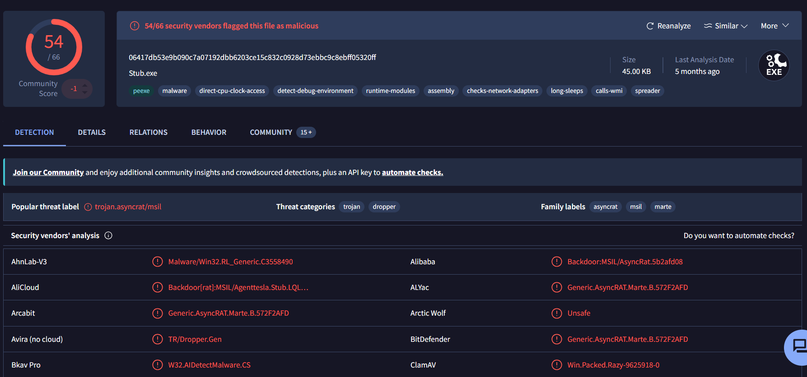
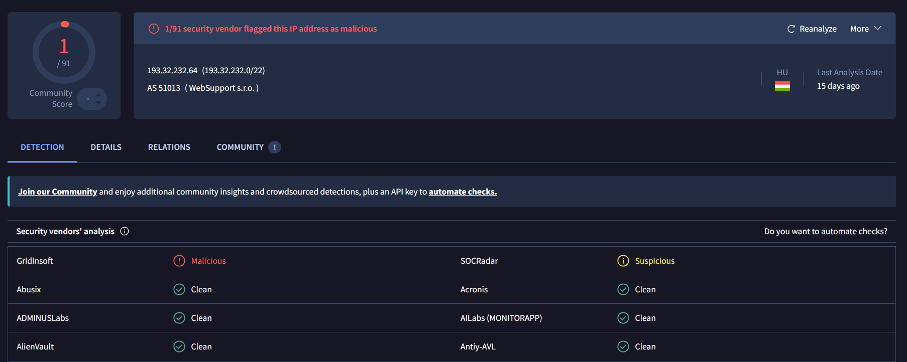
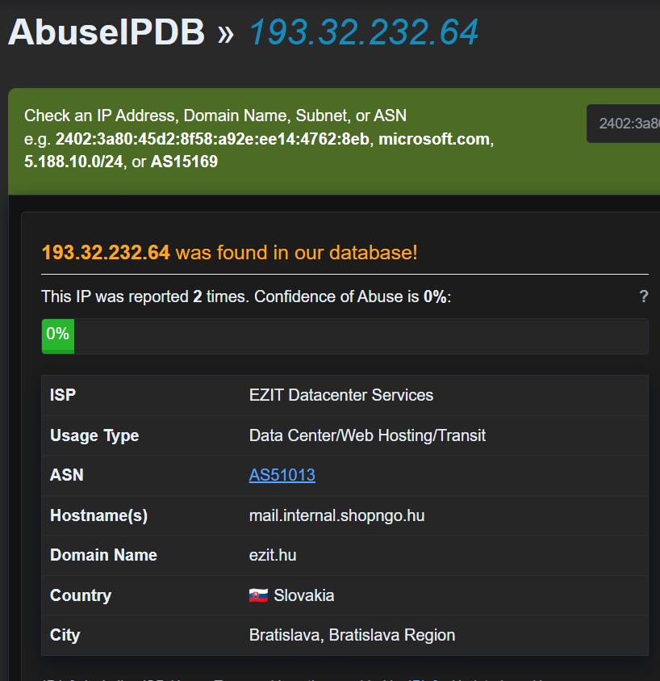

# SOC-Sim-006 — Malicious VBS Attachment Delivering AsyncRAT

**Platform:** Custom SOC Practice Lab (self-built simulation, enriched with real threat intelligence lookups)
**Alert ID:** SOC-Sim-006
**Severity:** High
**Category:** Phishing / Malware / Remote Access Trojan (AsyncRAT)

---

## 1. Alert Summary

An accounting user reported opening a `.vbs` invoice attachment from a
suspected vendor phishing email. EDR flagged a script host spawning
PowerShell with an encoded command, which dropped and executed a file
later confirmed via VirusTotal as AsyncRAT malware. The host then
established beaconing C2 traffic and a registry-based persistence
mechanism.

| Field | Value |
|---|---|
| Affected User | t.abara@acmecorp.com |
| Affected Host | WKS-ACC-0056 |
| Malicious Attachment | Invoice_47821_Overdue.vbs |
| Dropped File | svchost_up.exe |
| Dropped File SHA256 | `06417db53e9b090c7a07192dbb6203ce15c832c0928d73ebbc9c8ebff05320ff` |
| C2 IP:Port | 193.32.232.64:7777 |
| Alert Time | 09:41 – 09:47 UTC |

---

## 2. Investigation Steps

### 2.1 Delivery
Mail gateway logs showed the phishing email failed SPF and had no DKIM
record, sent from a spoofed vendor domain with a `.vbs` file disguised as
an overdue invoice inside a `.zip` attachment.

### 2.2 Execution Chain
```
09:44:18 - wscript.exe executes Invoice_47821_Overdue.vbs
09:44:19 - powershell.exe -w hidden -e [base64-encoded command]
09:44:20 - Dropped file: C:\Users\tabara\AppData\Local\Temp\svchost_up.exe
09:44:21 - SHA256 hash logged by EDR
09:44:22 - svchost_up.exe executed, parent: powershell.exe
09:44:25 - Outbound connection established to 193.32.232.64:7777
09:44:30 - Registry Run key created: HKCU\...\Run\WindowsUpdateSvc
```

### 2.3 Threat Intelligence Enrichment

**VirusTotal — File Hash**
The dropped file's SHA256 hash was submitted to VirusTotal:


*VirusTotal — 54/66 vendors flagged the file as malicious. Popular
threat label: `trojan.asyncrat/msil`. Family labels: asyncrat, msil,
marte.*

**VirusTotal — C2 IP**
The C2 IP address was also checked on VirusTotal:


*VirusTotal — only 1/91 vendors flagged 193.32.232.64 as malicious.*

**AbuseIPDB — C2 IP**


*AbuseIPDB — 193.32.232.64 reported only 2 times, 0% abuse confidence.
ISP: EZIT Datacenter Services, hosted in Slovakia.*

**Important finding — reputation source discrepancy:** the file hash
returned an overwhelming, high-confidence malicious verdict (54/66,
named malware family), while the C2 IP itself returned a very weak
signal on both VirusTotal (1/91) and AbuseIPDB (0% confidence, only 2
historical reports). This is a common and important pattern: attacker
C2 infrastructure is frequently hosted on legitimate shared/data-center
IP space and rotates quickly, so IP reputation databases often lag well
behind file-hash detection. **The behavioral and file-level evidence
(EDR process lineage, confirmed malware hash, non-standard port 7777,
registry persistence) is treated as conclusive here, independent of the
IP's weak reputation score.**

### 2.4 Noise Ruled Out
A print job for `Invoice_47821_Overdue.pdf` was investigated and
confirmed to be a separate, legitimate PDF document forwarded through
the normal accounting workflow — unrelated to the malicious `.vbs` file
despite the similar filename.

---

## 3. MITRE ATT&CK Mapping

| Tactic | Technique |
|---|---|
| Initial Access | T1566.001 – Spearphishing Attachment |
| Execution | T1059.005 – Visual Basic (VBS) |
| Execution | T1059.001 – PowerShell |
| Persistence | T1547.001 – Registry Run Keys |
| Command and Control | T1071 – Application Layer Protocol (non-standard port 7777) |

---

## 4. Verdict

> **True Positive — Confirmed AsyncRAT infection with active C2 and registry persistence.**

**Reasoning:**
- Dropped file hash confirmed malicious by 54/66 VirusTotal vendors, positively identified as AsyncRAT.
- Full process lineage confirmed via EDR: `.vbs` → PowerShell (encoded) → dropped executable → C2 connection.
- Registry Run key confirms deliberate persistence, not a one-time execution.
- AV real-time detection independently corroborated the malware family (`Trojan.MSIL.AsyncRAT`) though quarantine failed due to file lock.

---

## 5. Indicators of Compromise (IOC)

1. Phishing sender domain `vendorpay-invoices.com` (SPF fail, no DKIM).
2. Malicious attachment `Invoice_47821_Overdue.vbs`.
3. Dropped file `svchost_up.exe`, SHA256 `06417db53e9b090c7a07192dbb6203ce15c832c0928d73ebbc9c8ebff05320ff` — confirmed AsyncRAT (54/66 on VirusTotal).
4. C2 endpoint `193.32.232.64:7777` — weak reputation-database signal (1/91 VT, 0% AbuseIPDB), but behaviorally confirmed malicious via EDR and file-hash evidence.
5. Registry persistence key `HKCU\Software\Microsoft\Windows\CurrentVersion\Run\WindowsUpdateSvc`.

---

## 6. Containment & Recommendations

- [ ] Kill the `svchost_up.exe` process (and PowerShell parent, if still active) via EDR before attempting file removal — prior AV quarantine failed because the file was locked/in use.
- [ ] Remove the dropped file and the registry Run key.
- [ ] Isolate host WKS-ACC-0056 from the network.
- [ ] Treat this as a full RAT compromise, not just a malware infection — assume possible credential exposure and reset the affected user's passwords and any cached credentials on the host.
- [ ] Block the C2 IP `193.32.232.64:7777` and the sender domain `vendorpay-invoices.com` at the mail gateway/firewall.
- [ ] Forensically preserve the host (memory/disk image) before remediation given the RAT's potential for interactive attacker access.
- [ ] Search the environment for the same file hash, C2 IP, or registry key across all endpoints.
- [ ] Check the mail gateway for other recipients of the same phishing sender/subject pattern.
- [ ] Submit the confirmed hash to EDR/endpoint blocklists fleet-wide.

---

## 7. Closure

**Analyst Submission:** Malicious Activity Detected
**Alert Playbook Followed:** Yes
**Escalated:** Yes — confirmed RAT with potential interactive attacker access warrants Tier 2 review and organization-wide phishing sweep.

**Closure Note:**
> User t.abara opened a malicious `.vbs` attachment disguised as an
> overdue invoice, triggering an encoded PowerShell command that dropped
> and executed AsyncRAT (confirmed via VirusTotal, 54/66 detections).
> The malware established C2 communication on a non-standard port and
> created a registry Run key for persistence. Note: the C2 IP itself
> returned a weak reputation signal on VirusTotal and AbuseIPDB — the
> file-hash and behavioral evidence were treated as the authoritative
> indicators. Verdict: True Positive. Recommend process termination
> before file/registry cleanup, credential reset, and an organization-
> wide phishing sweep for the same sender pattern.

---

## Key Takeaways (Lessons for Future Investigations)

- File-hash reputation and IP reputation can diverge significantly —
  attacker C2 infrastructure is often hosted on legitimate, low-reputation
  shared hosting that hasn't yet been flagged, while the malware sample
  itself may be very well-documented. Don't let a "clean-looking" IP
  downgrade an otherwise well-confirmed malware case.
- Always record the actual detection ratio/confidence score from a
  lookup tool (e.g., "1/91" or "0% confidence"), not just "flagged" or
  "clean" — the number itself carries the real signal.
- When AV quarantine fails due to a locked/in-use file, the process must
  be killed first before the file and any persistence mechanisms can be
  reliably removed.
- A RAT (Remote Access Trojan) compromise should be treated as a
  potential full interactive compromise, not just a malware cleanup —
  credential exposure should be assumed until proven otherwise.
