# SOC127 — SQL Injection Detected

**Platform:** LetsDefend  
**Alert ID:** SOC127  
**Category:** Web Attack / SQL Injection

---

## 1. Alert Summary

Investigation of SOC127 identified automated SQL injection activity originating from **118.194.247.28** against a web application. Multiple requests targeted parameters such as `id` and `douj` with SQL injection payloads, while the HTTP User-Agent repeatedly identified **`sqlmap/1.7.2#stable`**. The requests tested several SQL injection techniques, including boolean-based conditions, `UNION SELECT`, error-based `EXTRACTVALUE()`, time-delay probes, and database-schema enumeration through `information_schema.tables`. One payload also contained XSS and `xp_cmdshell`/system-file access probes.

**Analysis (one line):** Automated `sqlmap` activity attempted to identify and exploit SQL injection, enumerate database structure, and probe additional execution paths; the supplied logs do not prove successful data extraction or server compromise.

---

## 2. Investigation Timeline

> The screenshots contain several web requests rather than a single ordered narrative. The timeline below is reconstructed from their timestamps and payload contents.

| Time (07 Mar 2024, UTC) | Observed Activity |
|---|---|
| 12:50:47 | Normal-looking `GET /` request observed with a Chrome User-Agent. This establishes browser traffic but, by itself, does not prove it belonged to the attacker. |
| 12:51:44 | `sqlmap/1.7.2#stable` request observed. |
| 12:51:45 | A combined payload tests boolean SQLi, `UNION ALL SELECT`, `information_schema.tables`, an XSS string, and an `xp_cmdshell` command-execution probe. |
| 12:53:07–12:53:10 | Additional automated SQLi probes test boolean expressions, `SELECT CASE`, `EXTRACTVALUE()`, and other DBMS-specific syntax. |
| 12:53:13 | Further conditional/DBMS-fingerprinting payloads are sent. |
| 12:53:15 | `WAITFOR DELAY` payloads test time-based/blind SQL injection behavior. |

Most displayed requests returned **HTTP 200** with a response size of **865 bytes**. A `200` response confirms that the web server handled the HTTP request, but it does **not** by itself prove that the injected SQL executed successfully.

---

## 3. Investigation Steps

### 3.1 Automated SQLMap Activity

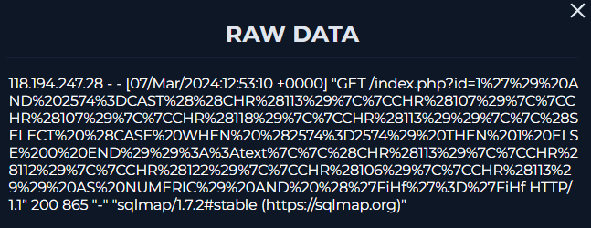

The request User-Agent identifies `sqlmap/1.7.2#stable`, strongly indicating automated SQL injection testing rather than ordinary browser activity.

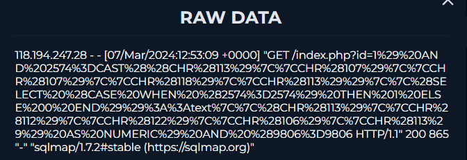

Repeated encoded payloads show the same source continuing to test the vulnerable-looking web parameter.

### 3.2 Error-Based SQL Injection Probe

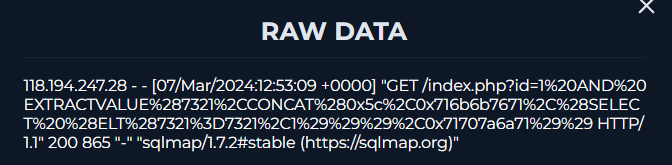

A request contains `EXTRACTVALUE(...)`. This function is commonly abused in error-based SQL injection to force a database error that may disclose attacker-selected database information in the error response.

### 3.3 Conditional / Boolean SQL Injection Testing

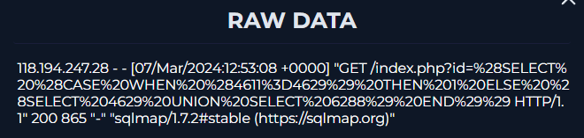

Payloads containing `SELECT CASE WHEN ... THEN ... ELSE ... END` test whether application responses change according to true/false database conditions.

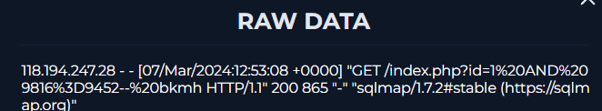

The `AND <value>=<value>` style probe is consistent with boolean-based SQL injection testing. An attacker/tool compares true and false conditions to determine whether the parameter influences a backend SQL query.

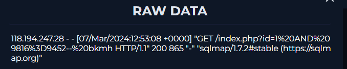

A second boolean-condition request provides another response for comparison during automated injection detection.

### 3.4 Additional SQLMap Probe

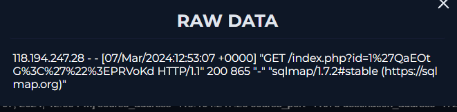

Another encoded request from the same source continues automated DBMS/injection testing.

### 3.5 Generic SQLMap Request

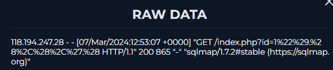

The User-Agent remains `sqlmap/1.7.2#stable`, correlating the requests as part of the same automated SQL injection activity.

### 3.6 Multi-Technique Exploitation Probe

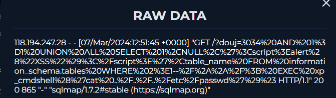

One of the strongest requests contains a combined payload conceptually similar to:

```text
3034 AND 1=1
UNION ALL SELECT 1,NULL,'<script>alert("XSS")</script>',table_name
FROM information_schema.tables
...
EXEC xp_cmdshell('cat ../../../etc/passwd')
```

This request probes several capabilities:

- `AND 1=1` — boolean SQL injection condition.
- `UNION ALL SELECT` — tests whether attacker-controlled query results can be combined with the legitimate query.
- `table_name FROM information_schema.tables` — attempts to enumerate database table names.
- `<script>alert("XSS")</script>` — tests whether attacker-controlled output may be reflected unsafely into a page.
- `xp_cmdshell(...)` — probes for operating-system command execution through Microsoft SQL Server functionality.
- `cat ../../../etc/passwd` — attempts to read a Unix/Linux account file if command execution and the target environment support it.

The mixture of DBMS- and OS-specific syntax is consistent with broad automated probing. The log shows the **attempt**, not confirmation that all of these components executed successfully.

### 3.7 Browser Traffic Observed

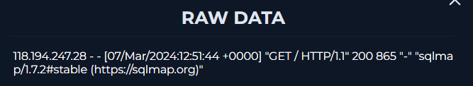

A request uses a normal Chrome User-Agent (`Mozilla/5.0 ... Chrome/122...`). This shows browser traffic to the application. Without additional session, authentication, or source-correlation evidence, it should not be stated as fact that this browser request was the attacker's reconnaissance.

### 3.8 Time-Based SQL Injection Testing

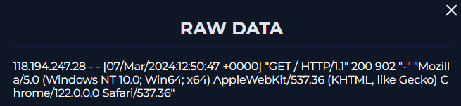

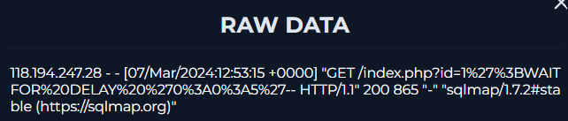

Payloads containing `WAITFOR DELAY` are characteristic of Microsoft SQL Server time-based/blind SQL injection testing. If execution causes a predictable response delay, the attacker can infer that injected SQL is being evaluated even when query output is not directly visible.

### 3.9 Additional Conditional / Fingerprinting Probes

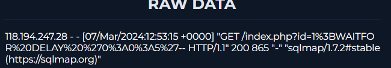

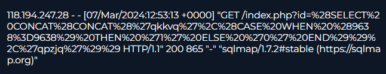

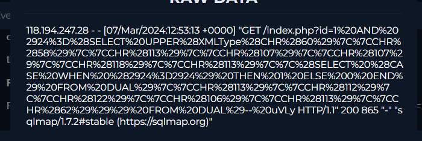

The remaining requests contain generated SQL expressions and DBMS-specific functions. These are consistent with `sqlmap` fingerprinting the backend database and testing which injection technique is usable.

---

## 4. Detection

The alert is supported by repeated malicious HTTP requests containing recognizable SQL injection syntax and a User-Agent explicitly identifying `sqlmap/1.7.2#stable`. The activity includes boolean conditions, `UNION SELECT`, schema enumeration, error-based extraction attempts, and time-delay probes. Together, these are strong indicators of an automated SQL injection attack rather than legitimate application usage.

---

## 5. Indicators of Compromise / Investigation Artifacts

| Type | Value | Context |
|---|---|---|
| Source IP | `118.194.247.28` | Source observed sending the SQL injection requests |
| Tool / User-Agent | `sqlmap/1.7.2#stable` | Automated SQL injection tool identified in web logs |
| Target Path | `/index.php?id=...` | Parameter repeatedly targeted by injected SQL |
| Target Parameter | `id` | SQL injection test location in multiple requests |
| Target Parameter | `douj` | Parameter targeted by the combined exploitation probe |
| SQL Keyword | `UNION ALL SELECT` | UNION-based SQL injection probe |
| Database Metadata | `information_schema.tables` | Database table enumeration attempt |
| Function | `EXTRACTVALUE()` | Error-based SQL injection probe |
| Function | `WAITFOR DELAY` | Time-based/blind SQL injection probe |
| Command-execution probe | `xp_cmdshell(...)` | Attempted OS command execution through SQL Server functionality |

> **IOC-enrichment note:** The supplied SOC127 evidence contains web-log screenshots only. No VirusTotal, AbuseIPDB, Shodan, or other threat-intelligence result for `118.194.247.28` was supplied, so this report does not assign external reputation, ASN, geolocation, or threat-actor attribution to the IP.

---

## 6. MITRE ATT&CK Mapping

| Tactic | Technique | Evidence |
|---|---|---|
| Initial Access | **T1190 — Exploit Public-Facing Application** | Malicious requests attempt to exploit an Internet-facing web parameter through SQL injection |

> The logs also contain probes for deeper capabilities such as command execution, but the supplied evidence does not confirm that those post-exploitation actions succeeded; therefore they are not mapped as confirmed attacker behavior here.

---

## 7. Verdict

> **True Positive — Confirmed automated SQL injection attack activity. Successful data theft or host compromise is not established by the supplied evidence.**

**Reasoning:**
- Repeated requests contain explicit SQL injection payloads.
- The User-Agent identifies the automated exploitation tool `sqlmap/1.7.2#stable`.
- Multiple techniques are tested: boolean-based, UNION-based, error-based, time-based, and schema-enumeration probes.
- `information_schema.tables` demonstrates an attempt to discover database structure.
- The combined payload additionally probes XSS and command execution.
- HTTP `200` responses show that the web server responded, but they do not demonstrate that database contents were returned or that OS commands executed.
- The supplied logs do not show dumped usernames/password hashes, returned table contents, shell access, or confirmed data exfiltration.

---

## 8. Containment & Recommendations

- [ ] Block or rate-limit malicious traffic from `118.194.247.28` as appropriate after validating business requirements.
- [ ] Review the affected application parameter(s), especially `id` and `douj`, for SQL injection vulnerabilities.
- [ ] Replace dynamically constructed SQL with **parameterized queries / prepared statements**.
- [ ] Validate and sanitize user-controlled input as an additional defense layer.
- [ ] Review web-server, application, WAF, and database logs to determine whether any injected statements actually executed.
- [ ] Search for database errors, unusual queries, large responses, table enumeration, or data-dump activity following the observed probes.
- [ ] Review authentication and application logs for signs of account compromise or unauthorized access.
- [ ] Add/tune WAF or SIEM detections for `sqlmap` User-Agents and patterns such as `UNION SELECT`, `information_schema`, `EXTRACTVALUE`, and `WAITFOR DELAY`.
- [ ] If successful exploitation is discovered, escalate to incident response and assess database confidentiality/integrity impact.

---

## 9. Closure

**Analyst Submission:** Malicious Activity Detected — SQL Injection Attack  
**Alert Playbook Followed:** Yes  
**Recommended Escalation:** Yes — application/database review is required to determine whether exploitation progressed beyond probing.

**Closure Note:**
> Investigation confirmed automated SQL injection activity from `118.194.247.28` using `sqlmap/1.7.2#stable`. The attacker tested boolean-, UNION-, error-, and time-based SQL injection techniques, attempted database schema enumeration through `information_schema.tables`, and sent additional XSS/command-execution probes. The activity is a True Positive. However, the available web logs do not prove successful database extraction, OS command execution, or data exfiltration. Recommend blocking the source as appropriate, reviewing the affected parameters for SQLi, implementing parameterized queries, and correlating application/database telemetry for evidence of successful exploitation.

---

## Key Takeaways

- A `sqlmap` User-Agent combined with SQL syntax in request parameters is strong evidence of automated SQL injection activity.
- `information_schema.tables` usually indicates database-schema discovery/enumeration rather than direct password theft.
- `EXTRACTVALUE()` can indicate error-based SQLi, while `WAITFOR DELAY` is commonly used for time-based/blind SQLi testing.
- `HTTP 200` means the web server returned a successful HTTP response; it does **not** prove that the SQL injection itself succeeded.
- Distinguish **confirmed attack activity** from **confirmed compromise**. In SOC127, the former is supported; the latter is not established by the supplied logs.
- Do not attribute a normal browser request to the attacker without session/source evidence that connects it to the malicious activity.
